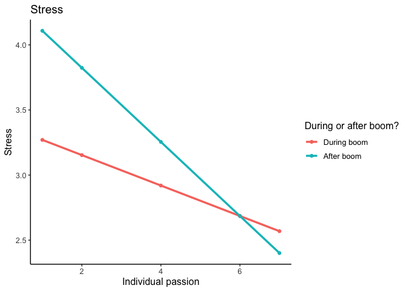
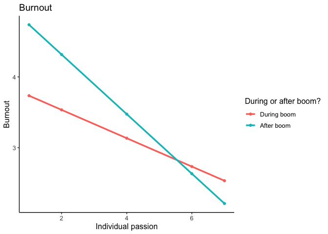
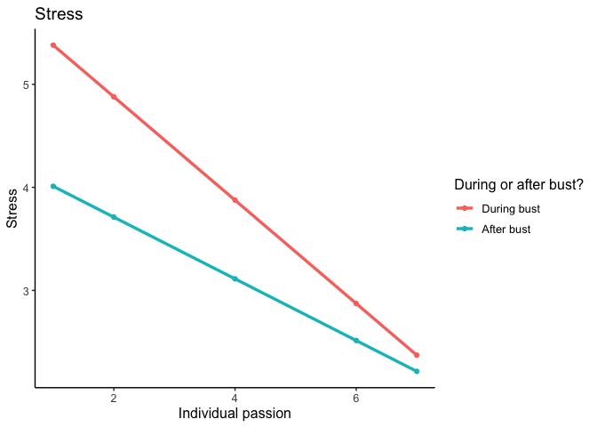
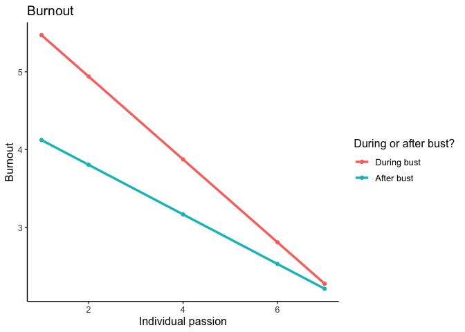

During vs. after booms/busts
================

Comparing what happens during vs. after a boom/bust (stress, burnout)

``` r
library(knitr)
library(dplyr)
library(anomaly)
library(tidyverse)
library(skimr)
library(nlme)
library(ggplot2)
library(effects)
library(psych)
```

Load anomaly data

``` r
load(file="d.an.Rdata")

# Remove teams with no anomalies
d.an <- d.an %>%
  filter(!is.na(anomalies.count))
```

Stress during/after a boom Variable “after.boom.phase” is a dummy that
is coded with 0= during a boom, and 1 = after a boom (first 4
measurements after a boom)

``` r
# Likelihood check
model_1r <- lme(fixed = s.em1 ~ s.pas + after.boom.phase,
                   random = ~1 | team/pid, 
                   data = d.an, 
                   na.action = na.omit, method = "ML")

model_1br <- lme(fixed = s.em1 ~ s.pas + s.pas*after.boom.phase,
                   random = ~1 | team/pid, 
                   data = d.an, 
                   na.action = na.omit, method = "ML")

anova(model_1r, model_1br)
```

    ##           Model df      AIC      BIC    logLik   Test  L.Ratio p-value
    ## model_1r      1  6 10050.47 10086.22 -5019.236                        
    ## model_1br     2  7 10024.21 10065.91 -5005.103 1 vs 2 28.26491  <.0001

``` r
## Second model is best (with interaction)

# Interaction with boom 
model_1b <- lme(fixed = s.em1 ~ s.pas + s.pas*after.boom.phase,
                   random = ~1 | team, 
                   data = d.an, 
                   na.action = na.omit, control = lmeControl(opt = "optim"))

summary(model_1b)
```

    ## Linear mixed-effects model fit by REML
    ##   Data: d.an 
    ##        AIC      BIC    logLik
    ##   10542.19 10577.93 -5265.097
    ## 
    ## Random effects:
    ##  Formula: ~1 | team
    ##         (Intercept) Residual
    ## StdDev:   0.6048444 1.493875
    ## 
    ## Fixed effects:  s.em1 ~ s.pas + s.pas * after.boom.phase 
    ##                            Value  Std.Error   DF   t-value p-value
    ## (Intercept)             3.387379 0.18315497 2806 18.494605       0
    ## s.pas                  -0.116936 0.02727963 2806 -4.286564       0
    ## after.boom.phase        1.005700 0.19576205 2806  5.137359       0
    ## s.pas:after.boom.phase -0.167683 0.03569248 2806 -4.697980       0
    ##  Correlation: 
    ##                        (Intr) s.pas  aftr..
    ## s.pas                  -0.851              
    ## after.boom.phase       -0.692  0.767       
    ## s.pas:after.boom.phase  0.615 -0.733 -0.951
    ## 
    ## Standardized Within-Group Residuals:
    ##        Min         Q1        Med         Q3        Max 
    ## -2.5757741 -0.7253815 -0.1425399  0.5920347  3.1747634 
    ## 
    ## Number of Observations: 2858
    ## Number of Groups: 49

Plots for stress during/after boom:

``` r
eff <- effect("s.pas:after.boom.phase", xlevels = list(after.boom.phase = c(0, 1)), model_1b)

effdata <- as.data.frame(eff)

effdata$after.boom.phase <- as.factor(effdata$after.boom.phase)

plot <- ggplot(effdata, aes(x = s.pas, y = fit, color = after.boom.phase, group = after.boom.phase)) +
  geom_point() +
  geom_line(size = 1.2) + 
  labs(title = "Stress", x= "Individual passion", y="Stress", color="During or after boom?", fill="During or after boom?") + theme_classic() + theme(text=element_text(size=12)) + 
  scale_fill_discrete(labels = c("During boom", "After boom")) +   scale_color_discrete(labels = c("During boom", "After boom"))

plot
```

<!-- -->

Burnout

``` r
# Likelihood check
model_2r <- lme(fixed = s.b2 ~ s.pas + after.boom.phase ,
                   random = ~1 | team/pid, 
                   data = d.an, 
                   na.action = na.omit, method = "ML")

model_2br <- lme(fixed = s.b2 ~ s.pas + after.boom.phase + s.pas*after.boom.phase,
                   random = ~1 | team/pid, 
                   data = d.an, 
                   na.action = na.omit, method = "ML")

anova(model_2r, model_2br)
```

    ##           Model df      AIC      BIC    logLik   Test  L.Ratio p-value
    ## model_2r      1  6 10268.19 10303.94 -5128.097                        
    ## model_2br     2  7 10227.12 10268.83 -5106.561 1 vs 2 43.07237  <.0001

``` r
## Second model with interaction is best

## Predicting future burnout from previous passion + interaction with boom 
model_2b <- lme(fixed = s.b2 ~ s.pas + after.boom.phase + s.pas*after.boom.phase,
                   random = ~1 | team/pid, 
                   data = d.an, 
                   na.action = na.omit)

summary(model_2b)
```

    ## Linear mixed-effects model fit by REML
    ##   Data: d.an 
    ##        AIC      BIC    logLik
    ##   10245.49 10287.18 -5115.744
    ## 
    ## Random effects:
    ##  Formula: ~1 | team
    ##         (Intercept)
    ## StdDev:   0.3796989
    ## 
    ##  Formula: ~1 | pid %in% team
    ##         (Intercept) Residual
    ## StdDev:   0.8808066 1.331077
    ## 
    ## Fixed effects:  s.b2 ~ s.pas + after.boom.phase + s.pas * after.boom.phase 
    ##                            Value  Std.Error   DF   t-value p-value
    ## (Intercept)             3.934127 0.17431504 2595 22.569062       0
    ## s.pas                  -0.200013 0.02651264 2595 -7.544077       0
    ## after.boom.phase        1.222139 0.18301636 2595  6.677757       0
    ## s.pas:after.boom.phase -0.220535 0.03350324 2595 -6.582498       0
    ##  Correlation: 
    ##                        (Intr) s.pas  aftr..
    ## s.pas                  -0.870              
    ## after.boom.phase       -0.686  0.750       
    ## s.pas:after.boom.phase  0.602 -0.703 -0.954
    ## 
    ## Standardized Within-Group Residuals:
    ##         Min          Q1         Med          Q3         Max 
    ## -4.55970023 -0.62316105 -0.05279772  0.55943141  3.38033254 
    ## 
    ## Number of Observations: 2858
    ## Number of Groups: 
    ##          team pid %in% team 
    ##            49           260

> Higher individual passion predicts lower burnout next measurement
> (main effect). Burnout is lower following a boom (main effect).
> Relationship between passion and next-measurement burnout is less
> strong if this occurs following a boom (interaction).

Plots:

``` r
eff <- effect("s.pas:after.boom.phase", xlevels = list(after.boom.phase = c(0, 1)), model_2b)

effdata <- as.data.frame(eff)

effdata$after.boom.phase <- as.factor(effdata$after.boom.phase)

plot <- ggplot(effdata, aes(x = s.pas, y = fit, color = after.boom.phase, group = after.boom.phase)) +
  geom_point() +
  geom_line(size = 1.2) + 
  labs(title = "Burnout", x= "Individual passion", y="Burnout", color="During or after boom?", fill="During or after boom?") + theme_classic() + theme(text=element_text(size=12)) + 
  scale_fill_discrete(labels = c("During boom", "After boom")) +   scale_color_discrete(labels = c("During boom", "After boom"))

plot
```

<!-- -->

Stress during/after bust

``` r
# Likelihood check
model_3r <- lme(fixed = s.em1 ~ s.pas + after.bust.phase,
                   random = ~1 | team/pid, 
                   data = d.an, 
                   na.action = na.omit, method = "ML")

model_3br <- lme(fixed = s.em1 ~ s.pas + after.bust.phase + s.pas*after.bust.phase,
                   random = ~1 | team/pid, 
                   data = d.an, 
                   na.action = na.omit, method = "ML")

anova(model_3r, model_3br)
```

    ##           Model df      AIC      BIC    logLik   Test  L.Ratio p-value
    ## model_3r      1  6 23850.74 23891.21 -11919.37                        
    ## model_3br     2  7 23793.79 23841.00 -11889.90 1 vs 2 58.95292  <.0001

``` r
## Second model is best

## Predicting stress during/after bust 
model_3b <- lme(fixed = s.em1 ~ s.pas + after.bust.phase + s.pas*after.bust.phase,
                   random = ~1 | team/pid, 
                   data = d.an, 
                   na.action = na.omit, control = lmeControl(opt = "optim"))

summary(model_3b)
```

    ## Linear mixed-effects model fit by REML
    ##   Data: d.an 
    ##        AIC      BIC    logLik
    ##   23815.05 23862.26 -11900.53
    ## 
    ## Random effects:
    ##  Formula: ~1 | team
    ##         (Intercept)
    ## StdDev:   0.2936061
    ## 
    ##  Formula: ~1 | pid %in% team
    ##         (Intercept) Residual
    ## StdDev:   0.5681784 1.543305
    ## 
    ## Fixed effects:  s.em1 ~ s.pas + after.bust.phase + s.pas * after.bust.phase 
    ##                            Value  Std.Error   DF   t-value p-value
    ## (Intercept)             5.881794 0.07330724 5777  80.23484       0
    ## s.pas                  -0.501515 0.01590885 5777 -31.52426       0
    ## after.bust.phase       -1.572181 0.12849449 5777 -12.23540       0
    ## s.pas:after.bust.phase  0.202161 0.02624548 5777   7.70269       0
    ##  Correlation: 
    ##                        (Intr) s.pas  aftr..
    ## s.pas                  -0.739              
    ## after.bust.phase       -0.383  0.400       
    ## s.pas:after.bust.phase  0.432 -0.579 -0.935
    ## 
    ## Standardized Within-Group Residuals:
    ##         Min          Q1         Med          Q3         Max 
    ## -3.44324200 -0.66620960 -0.05873433  0.61934966  3.86585598 
    ## 
    ## Number of Observations: 6275
    ## Number of Groups: 
    ##          team pid %in% team 
    ##            91           495

Plots:

``` r
eff <- effect("s.pas:after.bust.phase", xlevels = list(after.bust.phase = c(0, 1)), model_3b)

effdata <- as.data.frame(eff)

effdata$after.bust.phase <- as.factor(effdata$after.bust.phase)

plot <- ggplot(effdata, aes(x = s.pas, y = fit, color = after.bust.phase, group = after.bust.phase)) +
  geom_point() +
  geom_line(size = 1.2) + 
  labs(title = "Stress", x= "Individual passion", y="Stress", color="During or after bust?", fill="During or after bust?") + theme_classic() + theme(text=element_text(size=12)) + 
  scale_fill_discrete(labels = c("During bust", "After bust")) +   scale_color_discrete(labels = c("During bust", "After bust"))

plot
```

<!-- -->

Burnout during/after bust

``` r
# Likelihood check
model_4r <- lme(fixed = s.b2 ~ s.pas + after.bust.phase,
                   random = ~1 | team/pid, 
                   data = d.an, 
                   na.action = na.omit, method = "ML")

model_4br <- lme(fixed = s.b2 ~ s.pas + after.bust.phase + s.pas*after.bust.phase,
                   random = ~1 | team/pid, 
                   data = d.an, 
                   na.action = na.omit, method = "ML")

anova(model_4r, model_4br)
```

    ##           Model df      AIC      BIC    logLik   Test L.Ratio p-value
    ## model_4r      1  6 24177.26 24217.72 -12082.63                       
    ## model_4br     2  7 24116.35 24163.56 -12051.17 1 vs 2 62.9085  <.0001

``` r
## Second model is best

## Burnout during/after bust 
model_4b <- lme(fixed = s.b2 ~ s.pas + after.bust.phase + s.pas*after.bust.phase,
                   random = ~1 | team/pid, 
                   data = d.an, 
                   na.action = na.omit, control = lmeControl(opt = "optim"))

summary(model_4b)
```

    ## Linear mixed-effects model fit by REML
    ##   Data: d.an 
    ##        AIC      BIC    logLik
    ##   24137.46 24184.66 -12061.73
    ## 
    ## Random effects:
    ##  Formula: ~1 | team
    ##         (Intercept)
    ## StdDev:   0.2958944
    ## 
    ##  Formula: ~1 | pid %in% team
    ##         (Intercept) Residual
    ## StdDev:   0.5469644 1.588672
    ## 
    ## Fixed effects:  s.b2 ~ s.pas + after.bust.phase + s.pas * after.bust.phase 
    ##                            Value  Std.Error   DF   t-value p-value
    ## (Intercept)             6.005035 0.07447484 5776  80.63172       0
    ## s.pas                  -0.532977 0.01632955 5776 -32.63884       0
    ## after.bust.phase       -1.564003 0.13189188 5776 -11.85822       0
    ## s.pas:after.bust.phase  0.214174 0.02693975 5776   7.95012       0
    ##  Correlation: 
    ##                        (Intr) s.pas  aftr..
    ## s.pas                  -0.747              
    ## after.bust.phase       -0.388  0.401       
    ## s.pas:after.bust.phase  0.437 -0.580 -0.935
    ## 
    ## Standardized Within-Group Residuals:
    ##         Min          Q1         Med          Q3         Max 
    ## -3.28818339 -0.65557447 -0.06638521  0.63191651  3.58495619 
    ## 
    ## Number of Observations: 6274
    ## Number of Groups: 
    ##          team pid %in% team 
    ##            91           495

Plots:

``` r
eff <- effect("s.pas:after.bust.phase", xlevels = list(after.bust.phase = c(0, 1)), model_4b)

effdata <- as.data.frame(eff)

effdata$after.bust.phase <- as.factor(effdata$after.bust.phase)

plot <- ggplot(effdata, aes(x = s.pas, y = fit, color = after.bust.phase, group = after.bust.phase)) +
  geom_point() +
  geom_line(size = 1.2) + 
  labs(title = "Burnout", x= "Individual passion", y="Burnout", color="During or after bust?", fill="During or after bust?") + theme_classic() + theme(text=element_text(size=12)) + 
  scale_fill_discrete(labels = c("During bust", "After bust")) +   scale_color_discrete(labels = c("During bust", "After bust"))

plot
```

<!-- -->
