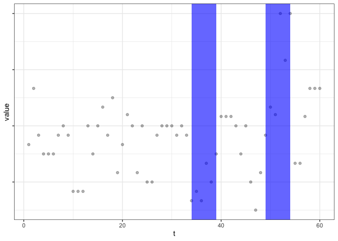

Anomalies in passion team average
================

> Detecting anomalies in average team passion (momentary mean of the
> team)

``` r
library(knitr)
library(dplyr)
library(anomaly)
library(tidyverse)
```

``` r
load(file="d.Rdata")
```

Team average passion

``` r
d <- d %>%
  group_by(pid) %>%
  mutate(m = 1:n()) %>%
  ungroup()

# There are 10 measurements with missings on passion, I delete these 
d <- d %>%
  filter(!is.na(s.pas))

# Team passion average and SD per measurement
d <- d %>%
  group_by(m, team) %>%
  mutate(sd.pas = sd(s.pas, na.rm=TRUE),
         mean.pas = mean(s.pas, na.rm=TRUE)) %>%
  ungroup()
```

Select one team to try out

``` r
d_1010 <- d %>%
  filter(team == 1010) 

# Select data at team-level 
d_1010.2 <-d_1010 %>%
  group_by(m) %>%
  slice(1) %>%
  ungroup()
```

CAPA: Anomalies in momentary team average. For the collective anomalies,
I select a period of 3 measurement points (1 day) as the minimum and 15
points (5 days).

``` r
res.1010 <- capa.uv(d_1010.2$mean.pas, min_seg_len = 6, max_seg_len = 15, type = "robustmean")

# Select collective anomalies
col.1010 <- collective_anomalies(res.1010)
                    
head(col.1010)
```

    ##   start end mean.change test.statistic
    ## 1    34  39    2.843361       17.06017
    ## 2    49  54    4.854692       29.12815

``` r
plot(res.1010)
```

<!-- -->

Now for all teams. Create dataframe to store start and end of
anomalies + variable that indicates whether measurement point falls in
the anomaly period (section).

``` r
d_t <-d %>%
  group_by(team, m) %>%
  slice(1) %>%
  ungroup()

df <- d_t[order(d_t$m),] 
df <- df %>%
  select(team, m, mean.pas)

df['start'] <- NA
df['end'] <- NA 
df['section'] <- NA
```

The capa.uv function resulted in errors for some teams:

``` r
x <- df
for (i in unique(x$team)) {
  tryCatch({
    res.capa <-
      capa.uv(
        x$mean.pas[x$team == i],
        min_seg_len = 6,
        max_seg_len = 15,
        type = "robustmean"
      )
    res <- collective_anomalies(res.capa)
    cat("For team", i, "'Res' has", nrow(res), "rows.\n")
  }, error = function(e) {
    message("ERROR: Team ", i, ": ", conditionMessage(e))
  })
}
```

    ## For team 1001 'Res' has 1 rows.
    ## For team 1002 'Res' has 0 rows.
    ## For team 1003 'Res' has 2 rows.
    ## For team 1004 'Res' has 0 rows.
    ## For team 1005 'Res' has 0 rows.
    ## For team 1006 'Res' has 1 rows.
    ## For team 1007 'Res' has 1 rows.
    ## For team 1008 'Res' has 1 rows.
    ## For team 1009 'Res' has 1 rows.
    ## For team 1010 'Res' has 2 rows.
    ## For team 1011 'Res' has 0 rows.
    ## For team 1012 'Res' has 0 rows.
    ## For team 1013 'Res' has 0 rows.
    ## For team 1014 'Res' has 0 rows.
    ## For team 1015 'Res' has 0 rows.
    ## For team 1016 'Res' has 1 rows.
    ## For team 1017 'Res' has 0 rows.
    ## For team 1018 'Res' has 0 rows.
    ## For team 1019 'Res' has 0 rows.
    ## For team 1020 'Res' has 1 rows.
    ## For team 1021 'Res' has 0 rows.
    ## For team 1022 'Res' has 0 rows.
    ## For team 1023 'Res' has 0 rows.

    ## ERROR: Team 1024: the transformed x contains NA values - check the transform function

    ## ERROR: Team 1025: the transformed x contains NA values - check the transform function

    ## For team 1026 'Res' has 3 rows.

    ## ERROR: Team 1027: the transformed x contains NA values - check the transform function

    ## ERROR: Team 1028: the transformed x contains NA values - check the transform function

    ## For team 1029 'Res' has 2 rows.

    ## ERROR: Team 1030: the transformed x contains NA values - check the transform function

    ## ERROR: Team 1031: the transformed x contains NA values - check the transform function

    ## ERROR: Team 1032: the transformed x contains NA values - check the transform function

    ## ERROR: Team 1033: the transformed x contains NA values - check the transform function

    ## ERROR: Team 1034: the transformed x contains NA values - check the transform function

    ## For team 1035 'Res' has 0 rows.

    ## ERROR: Team 1036: the transformed x contains NA values - check the transform function

    ## For team 1037 'Res' has 0 rows.
    ## For team 1038 'Res' has 1 rows.
    ## For team 1040 'Res' has 3 rows.
    ## For team 1041 'Res' has 1 rows.
    ## For team 1042 'Res' has 2 rows.
    ## For team 1043 'Res' has 1 rows.
    ## For team 1044 'Res' has 3 rows.
    ## For team 1045 'Res' has 1 rows.
    ## For team 1046 'Res' has 1 rows.
    ## For team 1047 'Res' has 2 rows.
    ## For team 1048 'Res' has 2 rows.
    ## For team 1049 'Res' has 1 rows.
    ## For team 1050 'Res' has 2 rows.

    ## ERROR: Team 1051: the transformed x contains NA values - check the transform function

    ## For team 1053 'Res' has 2 rows.
    ## For team 1054 'Res' has 1 rows.

    ## ERROR: Team 1055: the transformed x contains NA values - check the transform function

    ## ERROR: Team 1056: the transformed x contains NA values - check the transform function

    ## For team 1057 'Res' has 1 rows.

    ## ERROR: Team 1058: the transformed x contains NA values - check the transform function

    ## For team 1059 'Res' has 2 rows.
    ## For team 1060 'Res' has 1 rows.
    ## For team 1061 'Res' has 0 rows.
    ## For team 1062 'Res' has 2 rows.
    ## For team 1063 'Res' has 3 rows.
    ## For team 1064 'Res' has 3 rows.
    ## For team 1065 'Res' has 3 rows.
    ## For team 1066 'Res' has 1 rows.
    ## For team 1067 'Res' has 2 rows.
    ## For team 1068 'Res' has 0 rows.
    ## For team 1069 'Res' has 2 rows.
    ## For team 1070 'Res' has 3 rows.
    ## For team 1071 'Res' has 4 rows.

    ## ERROR: Team 1072: the transformed x contains NA values - check the transform function

    ## ERROR: Team 1073: the transformed x contains NA values - check the transform function

    ## For team 1074 'Res' has 1 rows.
    ## For team 1075 'Res' has 1 rows.
    ## For team 1076 'Res' has 0 rows.

    ## ERROR: Team 1077: the transformed x contains NA values - check the transform function

    ## For team 1078 'Res' has 3 rows.
    ## For team 1079 'Res' has 2 rows.
    ## For team 1081 'Res' has 1 rows.
    ## For team 1082 'Res' has 1 rows.
    ## For team 1083 'Res' has 1 rows.

    ## ERROR: Team 1084: the transformed x contains NA values - check the transform function

    ## For team 1085 'Res' has 1 rows.

    ## ERROR: Team 1086: the transformed x contains NA values - check the transform function

    ## For team 1087 'Res' has 3 rows.
    ## For team 1089 'Res' has 1 rows.

    ## ERROR: Team 1090: the transformed x contains NA values - check the transform function

    ## For team 1091 'Res' has 2 rows.

    ## ERROR: Team 1092: the transformed x contains NA values - check the transform function

    ## For team 1093 'Res' has 1 rows.
    ## For team 1094 'Res' has 2 rows.
    ## For team 1095 'Res' has 2 rows.
    ## For team 1096 'Res' has 2 rows.

    ## ERROR: Team 1097: the transformed x contains NA values - check the transform function

    ## ERROR: Team 1098: the transformed x contains NA values - check the transform function

    ## ERROR: Team 1099: the transformed x contains NA values - check the transform function

    ## For team 1100 'Res' has 0 rows.
    ## For team 1101 'Res' has 1 rows.
    ## For team 1102 'Res' has 1 rows.
    ## For team 1104 'Res' has 0 rows.
    ## For team 1105 'Res' has 0 rows.
    ## For team 1106 'Res' has 1 rows.
    ## For team 1107 'Res' has 1 rows.
    ## For team 1108 'Res' has 2 rows.
    ## For team 1109 'Res' has 0 rows.
    ## For team 1110 'Res' has 2 rows.
    ## For team 1111 'Res' has 0 rows.
    ## For team 1112 'Res' has 2 rows.
    ## For team 1113 'Res' has 1 rows.
    ## For team 1114 'Res' has 0 rows.
    ## For team 1115 'Res' has 2 rows.
    ## For team 1116 'Res' has 4 rows.

    ## ERROR: Team 1117: the transformed x contains NA values - check the transform function

    ## For team 1118 'Res' has 1 rows.
    ## For team 1119 'Res' has 1 rows.
    ## For team 1120 'Res' has 1 rows.
    ## For team 1121 'Res' has 1 rows.
    ## For team 1122 'Res' has 0 rows.
    ## For team 1123 'Res' has 0 rows.
    ## For team 1124 'Res' has 2 rows.
    ## For team 1125 'Res' has 2 rows.
    ## For team 1126 'Res' has 2 rows.
    ## For team 1128 'Res' has 3 rows.
    ## For team 1129 'Res' has 0 rows.
    ## For team 1130 'Res' has 0 rows.
    ## For team 1131 'Res' has 0 rows.
    ## For team 1132 'Res' has 0 rows.
    ## For team 1133 'Res' has 0 rows.
    ## For team 1134 'Res' has 0 rows.
    ## For team 1135 'Res' has 1 rows.
    ## For team 1136 'Res' has 0 rows.
    ## For team 1137 'Res' has 2 rows.
    ## For team 1138 'Res' has 2 rows.
    ## For team 1139 'Res' has 1 rows.
    ## For team 1140 'Res' has 1 rows.
    ## For team 1141 'Res' has 2 rows.
    ## For team 1142 'Res' has 1 rows.
    ## For team 1143 'Res' has 1 rows.
    ## For team 1144 'Res' has 1 rows.
    ## For team 1145 'Res' has 0 rows.
    ## For team 1146 'Res' has 0 rows.
    ## For team 1148 'Res' has 2 rows.
    ## For team 1149 'Res' has 2 rows.
    ## For team 1150 'Res' has 1 rows.

    ## ERROR: Team 1151: the transformed x contains NA values - check the transform function

    ## For team 1152 'Res' has 1 rows.
    ## For team 1153 'Res' has 1 rows.
    ## For team 1154 'Res' has 1 rows.
    ## For team 1155 'Res' has 0 rows.
    ## For team 1156 'Res' has 1 rows.
    ## For team 1157 'Res' has 0 rows.
    ## For team 1158 'Res' has 3 rows.
    ## For team 1159 'Res' has 1 rows.
    ## For team 1161 'Res' has 0 rows.
    ## For team 2085 'Res' has 0 rows.

    ## ERROR: Team 2201: the transformed x contains NA values - check the transform function

Errors for the following teams: 1024, 1025, 1027, 1028, 1030, 1031,
1032, 1033, 1034, 1036, 1051, 1055, 1056, 1058, 1072, 1073, 1077, 1084,
1086, 1090, 1092, 1097, 1098, 1099, 1117, 1151, 2201.

Examine if this is due to low variance (robust MAD):

``` r
# 1024 as example
x <- df
i <- 1024 # team
x$mean.pas[x$team == i] # look at raw data: lots of scores are the same
```

    ##  [1] 5.571429 5.571429 5.571429 5.571429 5.571429 5.571429 5.714286 5.714286
    ##  [9] 5.714286 5.571429 5.571429 5.571429 5.571429 5.571429 5.571429 5.571429
    ## [17] 5.571429 5.571429 5.571429 5.571429 5.571429 5.571429 5.571429 5.571429
    ## [25] 5.571429 5.571429 5.571429 5.571429 5.571429 5.571429 5.571429 5.571429
    ## [33] 5.571429 5.857143 5.857143 5.857143 5.571429 5.571429 5.571429 6.142857
    ## [41] 6.142857 6.000000 5.571429 5.571429 5.571429 5.571429 5.571429 5.571429
    ## [49] 5.428571 5.428571 5.428571 5.571429 5.571429 5.571429 5.571429 5.571429
    ## [57] 5.571429 5.571429 5.571429 5.571429

``` r
median(x$mean.pas[x$team == i]) # check robust central tendency
```

    ## [1] 5.571429

``` r
mad(x$mean.pas[x$team == i]) # check robust variance: MAD is 0 
```

    ## [1] 0

``` r
rm(x, i, res.capa, res)

# Low variance in mean scores happens in all teams in which I get error messages:
df %>%
  group_by(team) %>%
  dplyr::summarise(mad = mad(mean.pas)) %>%
  arrange(mad)
```

    ## # A tibble: 155 × 2
    ##     team   mad
    ##    <dbl> <dbl>
    ##  1  1024     0
    ##  2  1025     0
    ##  3  1027     0
    ##  4  1028     0
    ##  5  1030     0
    ##  6  1031     0
    ##  7  1032     0
    ##  8  1033     0
    ##  9  1034     0
    ## 10  1036     0
    ## # … with 145 more rows

``` r
# I remove those teams
df <- df %>%
  group_by(team) %>%
  dplyr::mutate(mad = mad(mean.pas))

df <- df %>%
  filter(mad > 0)

df <- df %>%
  select(-mad)

n_distinct(df$team)
```

    ## [1] 128

``` r
# This leaves 128 teams
```

``` r
get.an.Ignore <- function(x) {
  # FOR TESTING:
  # x = df
  # i = 1024
  
  for (i in unique(x$team)) {
    # reset for error handling
    res.capa <- NA
    
    tryCatch({
      res.capa <-
        capa.uv(
          x$mean.pas[x$team == i],
          min_seg_len = 6,
          max_seg_len = 15,
          type = "robustmean"
        )
      res <- collective_anomalies(res.capa)
      cat("Team", i, "has", nrow(res), "anomalous segments.\n")
    }, error = function(e) {
      message("ERROR: Team ", i, ": ", conditionMessage(e))
    })
    
    if (is.na(res.capa)) { # If error detected
      x[x$team == i,] <-
        x %>%
        filter(team == i) %>%
        mutate(start = NaN, # set to NaN to distinguish it from unprocessed or working values
               end = NaN) # set to NaN to distinguish it from unprocessed or working values
      
    } else if (nrow(res) > 0) { # If anomaly detected
      x[x$team == i,] <-
        x %>%
        filter(team == i) %>%
        mutate(start = ifelse(m %in% res$start, 1, 0),
               end = ifelse(m %in% res$end, 1, 0))
      
    } else { # If no anomaly detected
      x[x$team == i,] <-
        x %>%
        filter(team == i) %>%
        mutate(start = -99, # set to -99 to distinguish it from unprocessed NAs could be set to 0 or NA instead
               end = -99) # set to -99 to distinguish it from unprocessed NAs could be set to 0 or NA instead
    }
  }
  return(x)
}
AnIgnoreError <- get.an.Ignore(df)
```

    ## Team 1001 has 1 anomalous segments.
    ## Team 1002 has 0 anomalous segments.
    ## Team 1003 has 2 anomalous segments.
    ## Team 1004 has 0 anomalous segments.
    ## Team 1005 has 0 anomalous segments.
    ## Team 1006 has 1 anomalous segments.
    ## Team 1007 has 1 anomalous segments.
    ## Team 1008 has 1 anomalous segments.
    ## Team 1009 has 1 anomalous segments.
    ## Team 1010 has 2 anomalous segments.
    ## Team 1011 has 0 anomalous segments.
    ## Team 1012 has 0 anomalous segments.
    ## Team 1013 has 0 anomalous segments.
    ## Team 1014 has 0 anomalous segments.
    ## Team 1015 has 0 anomalous segments.
    ## Team 1016 has 1 anomalous segments.
    ## Team 1017 has 0 anomalous segments.
    ## Team 1018 has 0 anomalous segments.
    ## Team 1019 has 0 anomalous segments.
    ## Team 1020 has 1 anomalous segments.
    ## Team 1021 has 0 anomalous segments.
    ## Team 1022 has 0 anomalous segments.
    ## Team 1023 has 0 anomalous segments.
    ## Team 1026 has 3 anomalous segments.
    ## Team 1029 has 2 anomalous segments.
    ## Team 1035 has 0 anomalous segments.
    ## Team 1037 has 0 anomalous segments.
    ## Team 1038 has 1 anomalous segments.
    ## Team 1040 has 3 anomalous segments.
    ## Team 1041 has 1 anomalous segments.
    ## Team 1042 has 2 anomalous segments.
    ## Team 1043 has 1 anomalous segments.
    ## Team 1044 has 3 anomalous segments.
    ## Team 1045 has 1 anomalous segments.
    ## Team 1046 has 1 anomalous segments.
    ## Team 1047 has 2 anomalous segments.
    ## Team 1048 has 2 anomalous segments.
    ## Team 1049 has 1 anomalous segments.
    ## Team 1050 has 2 anomalous segments.
    ## Team 1053 has 2 anomalous segments.
    ## Team 1054 has 1 anomalous segments.
    ## Team 1057 has 1 anomalous segments.
    ## Team 1059 has 2 anomalous segments.
    ## Team 1060 has 1 anomalous segments.
    ## Team 1061 has 0 anomalous segments.
    ## Team 1062 has 2 anomalous segments.
    ## Team 1063 has 3 anomalous segments.
    ## Team 1064 has 3 anomalous segments.
    ## Team 1065 has 3 anomalous segments.
    ## Team 1066 has 1 anomalous segments.
    ## Team 1067 has 2 anomalous segments.
    ## Team 1068 has 0 anomalous segments.
    ## Team 1069 has 2 anomalous segments.
    ## Team 1070 has 3 anomalous segments.
    ## Team 1071 has 4 anomalous segments.
    ## Team 1074 has 1 anomalous segments.
    ## Team 1075 has 1 anomalous segments.
    ## Team 1076 has 0 anomalous segments.
    ## Team 1078 has 3 anomalous segments.
    ## Team 1079 has 2 anomalous segments.
    ## Team 1081 has 1 anomalous segments.
    ## Team 1082 has 1 anomalous segments.
    ## Team 1083 has 1 anomalous segments.
    ## Team 1085 has 1 anomalous segments.
    ## Team 1087 has 3 anomalous segments.
    ## Team 1089 has 1 anomalous segments.
    ## Team 1091 has 2 anomalous segments.
    ## Team 1093 has 1 anomalous segments.
    ## Team 1094 has 2 anomalous segments.
    ## Team 1095 has 2 anomalous segments.
    ## Team 1096 has 2 anomalous segments.
    ## Team 1100 has 0 anomalous segments.
    ## Team 1101 has 1 anomalous segments.
    ## Team 1102 has 1 anomalous segments.
    ## Team 1104 has 0 anomalous segments.
    ## Team 1105 has 0 anomalous segments.
    ## Team 1106 has 1 anomalous segments.
    ## Team 1107 has 1 anomalous segments.
    ## Team 1108 has 2 anomalous segments.
    ## Team 1109 has 0 anomalous segments.
    ## Team 1110 has 2 anomalous segments.
    ## Team 1111 has 0 anomalous segments.
    ## Team 1112 has 2 anomalous segments.
    ## Team 1113 has 1 anomalous segments.
    ## Team 1114 has 0 anomalous segments.
    ## Team 1115 has 2 anomalous segments.
    ## Team 1116 has 4 anomalous segments.
    ## Team 1118 has 1 anomalous segments.
    ## Team 1119 has 1 anomalous segments.
    ## Team 1120 has 1 anomalous segments.
    ## Team 1121 has 1 anomalous segments.
    ## Team 1122 has 0 anomalous segments.
    ## Team 1123 has 0 anomalous segments.
    ## Team 1124 has 2 anomalous segments.
    ## Team 1125 has 2 anomalous segments.
    ## Team 1126 has 2 anomalous segments.
    ## Team 1128 has 3 anomalous segments.
    ## Team 1129 has 0 anomalous segments.
    ## Team 1130 has 0 anomalous segments.
    ## Team 1131 has 0 anomalous segments.
    ## Team 1132 has 0 anomalous segments.
    ## Team 1133 has 0 anomalous segments.
    ## Team 1134 has 0 anomalous segments.
    ## Team 1135 has 1 anomalous segments.
    ## Team 1136 has 0 anomalous segments.
    ## Team 1137 has 2 anomalous segments.
    ## Team 1138 has 2 anomalous segments.
    ## Team 1139 has 1 anomalous segments.
    ## Team 1140 has 1 anomalous segments.
    ## Team 1141 has 2 anomalous segments.
    ## Team 1142 has 1 anomalous segments.
    ## Team 1143 has 1 anomalous segments.
    ## Team 1144 has 1 anomalous segments.
    ## Team 1145 has 0 anomalous segments.
    ## Team 1146 has 0 anomalous segments.
    ## Team 1148 has 2 anomalous segments.
    ## Team 1149 has 2 anomalous segments.
    ## Team 1150 has 1 anomalous segments.
    ## Team 1152 has 1 anomalous segments.
    ## Team 1153 has 1 anomalous segments.
    ## Team 1154 has 1 anomalous segments.
    ## Team 1155 has 0 anomalous segments.
    ## Team 1156 has 1 anomalous segments.
    ## Team 1157 has 0 anomalous segments.
    ## Team 1158 has 3 anomalous segments.
    ## Team 1159 has 1 anomalous segments.
    ## Team 1161 has 0 anomalous segments.
    ## Team 2085 has 0 anomalous segments.

I added three variables to the dataframe to indicate whether a
measurement point was a start of an anomaly (start), end (end), and it
is in the anomaly period (section):

``` r
get.an.Section.Ignore <- function(x) {
  # FOR TESTING:
  # x = df
  # i = 1010
  
  for (i in unique(x$team)) {
    # reset for error handling
    res.capa <- NA
    
    tryCatch({
      res.capa <-
        capa.uv(
          x$mean.pas[x$team == i],
          min_seg_len = 6,
          max_seg_len = 15,
          type = "robustmean"
        )
      res <- collective_anomalies(res.capa)
      cat("Team", i, "has", nrow(res), "anomalous segments.\n")
    }, error = function(e) {
      message("ERROR: Team ", i, ": ", conditionMessage(e))
    })
    
    if (is.na(res.capa)) { # If error detected
      x[x$team == i,] <-
        x %>%
        filter(team == i) %>%
        mutate(start = NaN, # set to NaN to distinguish it from unprocessed or working values
               end = NaN, # set to NaN to distinguish it from unprocessed or working values
               section = NaN) # set to NaN to distinguish it from unprocessed or working values
      
    } else if (nrow(res) > 0) { # If anomaly detected
      
      anomalySection <- mapply(seq, res$start, res$end, SIMPLIFY = FALSE) %>% unlist
        
      x[x$team == i,] <-
        x %>%
        filter(team == i) %>%
        mutate(start = ifelse(m %in% res$start, 1, 0),
               end = ifelse(m %in% res$end, 1, 0),
               section = ifelse(m %in% anomalySection, 1, 0))
      
    } else { # If no anomaly detected
      x[x$team == i,] <-
        x %>%
        filter(team == i) %>%
        mutate(start = -99, # set to -99 to distinguish it from unprocessed NAs could be set to 0 or NA instead
               end = -99, # set to -99 to distinguish it from unprocessed NAs could be set to 0 or NA instead
               section = -99) # set to -99 to distinguish it from unprocessed NAs could be set to 0 or NA instead
    }
  }
  return(x)
}

anomalies <- get.an.Section.Ignore(df) %>% arrange(team)
```

    ## Team 1001 has 1 anomalous segments.
    ## Team 1002 has 0 anomalous segments.
    ## Team 1003 has 2 anomalous segments.
    ## Team 1004 has 0 anomalous segments.
    ## Team 1005 has 0 anomalous segments.
    ## Team 1006 has 1 anomalous segments.
    ## Team 1007 has 1 anomalous segments.
    ## Team 1008 has 1 anomalous segments.
    ## Team 1009 has 1 anomalous segments.
    ## Team 1010 has 2 anomalous segments.
    ## Team 1011 has 0 anomalous segments.
    ## Team 1012 has 0 anomalous segments.
    ## Team 1013 has 0 anomalous segments.
    ## Team 1014 has 0 anomalous segments.
    ## Team 1015 has 0 anomalous segments.
    ## Team 1016 has 1 anomalous segments.
    ## Team 1017 has 0 anomalous segments.
    ## Team 1018 has 0 anomalous segments.
    ## Team 1019 has 0 anomalous segments.
    ## Team 1020 has 1 anomalous segments.
    ## Team 1021 has 0 anomalous segments.
    ## Team 1022 has 0 anomalous segments.
    ## Team 1023 has 0 anomalous segments.
    ## Team 1026 has 3 anomalous segments.
    ## Team 1029 has 2 anomalous segments.
    ## Team 1035 has 0 anomalous segments.
    ## Team 1037 has 0 anomalous segments.
    ## Team 1038 has 1 anomalous segments.
    ## Team 1040 has 3 anomalous segments.
    ## Team 1041 has 1 anomalous segments.
    ## Team 1042 has 2 anomalous segments.
    ## Team 1043 has 1 anomalous segments.
    ## Team 1044 has 3 anomalous segments.
    ## Team 1045 has 1 anomalous segments.
    ## Team 1046 has 1 anomalous segments.
    ## Team 1047 has 2 anomalous segments.
    ## Team 1048 has 2 anomalous segments.
    ## Team 1049 has 1 anomalous segments.
    ## Team 1050 has 2 anomalous segments.
    ## Team 1053 has 2 anomalous segments.
    ## Team 1054 has 1 anomalous segments.
    ## Team 1057 has 1 anomalous segments.
    ## Team 1059 has 2 anomalous segments.
    ## Team 1060 has 1 anomalous segments.
    ## Team 1061 has 0 anomalous segments.
    ## Team 1062 has 2 anomalous segments.
    ## Team 1063 has 3 anomalous segments.
    ## Team 1064 has 3 anomalous segments.
    ## Team 1065 has 3 anomalous segments.
    ## Team 1066 has 1 anomalous segments.
    ## Team 1067 has 2 anomalous segments.
    ## Team 1068 has 0 anomalous segments.
    ## Team 1069 has 2 anomalous segments.
    ## Team 1070 has 3 anomalous segments.
    ## Team 1071 has 4 anomalous segments.
    ## Team 1074 has 1 anomalous segments.
    ## Team 1075 has 1 anomalous segments.
    ## Team 1076 has 0 anomalous segments.
    ## Team 1078 has 3 anomalous segments.
    ## Team 1079 has 2 anomalous segments.
    ## Team 1081 has 1 anomalous segments.
    ## Team 1082 has 1 anomalous segments.
    ## Team 1083 has 1 anomalous segments.
    ## Team 1085 has 1 anomalous segments.
    ## Team 1087 has 3 anomalous segments.
    ## Team 1089 has 1 anomalous segments.
    ## Team 1091 has 2 anomalous segments.
    ## Team 1093 has 1 anomalous segments.
    ## Team 1094 has 2 anomalous segments.
    ## Team 1095 has 2 anomalous segments.
    ## Team 1096 has 2 anomalous segments.
    ## Team 1100 has 0 anomalous segments.
    ## Team 1101 has 1 anomalous segments.
    ## Team 1102 has 1 anomalous segments.
    ## Team 1104 has 0 anomalous segments.
    ## Team 1105 has 0 anomalous segments.
    ## Team 1106 has 1 anomalous segments.
    ## Team 1107 has 1 anomalous segments.
    ## Team 1108 has 2 anomalous segments.
    ## Team 1109 has 0 anomalous segments.
    ## Team 1110 has 2 anomalous segments.
    ## Team 1111 has 0 anomalous segments.
    ## Team 1112 has 2 anomalous segments.
    ## Team 1113 has 1 anomalous segments.
    ## Team 1114 has 0 anomalous segments.
    ## Team 1115 has 2 anomalous segments.
    ## Team 1116 has 4 anomalous segments.
    ## Team 1118 has 1 anomalous segments.
    ## Team 1119 has 1 anomalous segments.
    ## Team 1120 has 1 anomalous segments.
    ## Team 1121 has 1 anomalous segments.
    ## Team 1122 has 0 anomalous segments.
    ## Team 1123 has 0 anomalous segments.
    ## Team 1124 has 2 anomalous segments.
    ## Team 1125 has 2 anomalous segments.
    ## Team 1126 has 2 anomalous segments.
    ## Team 1128 has 3 anomalous segments.
    ## Team 1129 has 0 anomalous segments.
    ## Team 1130 has 0 anomalous segments.
    ## Team 1131 has 0 anomalous segments.
    ## Team 1132 has 0 anomalous segments.
    ## Team 1133 has 0 anomalous segments.
    ## Team 1134 has 0 anomalous segments.
    ## Team 1135 has 1 anomalous segments.
    ## Team 1136 has 0 anomalous segments.
    ## Team 1137 has 2 anomalous segments.
    ## Team 1138 has 2 anomalous segments.
    ## Team 1139 has 1 anomalous segments.
    ## Team 1140 has 1 anomalous segments.
    ## Team 1141 has 2 anomalous segments.
    ## Team 1142 has 1 anomalous segments.
    ## Team 1143 has 1 anomalous segments.
    ## Team 1144 has 1 anomalous segments.
    ## Team 1145 has 0 anomalous segments.
    ## Team 1146 has 0 anomalous segments.
    ## Team 1148 has 2 anomalous segments.
    ## Team 1149 has 2 anomalous segments.
    ## Team 1150 has 1 anomalous segments.
    ## Team 1152 has 1 anomalous segments.
    ## Team 1153 has 1 anomalous segments.
    ## Team 1154 has 1 anomalous segments.
    ## Team 1155 has 0 anomalous segments.
    ## Team 1156 has 1 anomalous segments.
    ## Team 1157 has 0 anomalous segments.
    ## Team 1158 has 3 anomalous segments.
    ## Team 1159 has 1 anomalous segments.
    ## Team 1161 has 0 anomalous segments.
    ## Team 2085 has 0 anomalous segments.

There are several teams with no anomalies (indicated with -99), how
many:

``` r
no.anomalies <- anomalies %>%
  filter(start == -99)

no.anomalies %>% ungroup() %>% dplyr::summarise(n = n_distinct(team))
```

    ## # A tibble: 1 × 1
    ##       n
    ##   <int>
    ## 1    40

``` r
# 40 teams without anomalies
# 128 - 40 = 88 teams have an anomaly in their average passion
```

``` r
d <- d %>%
  left_join(anomalies, by = c("team", "m", "mean.pas"))
```
