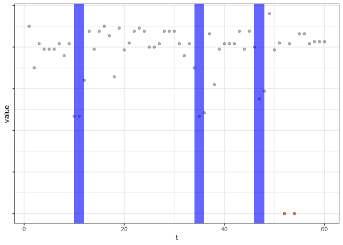
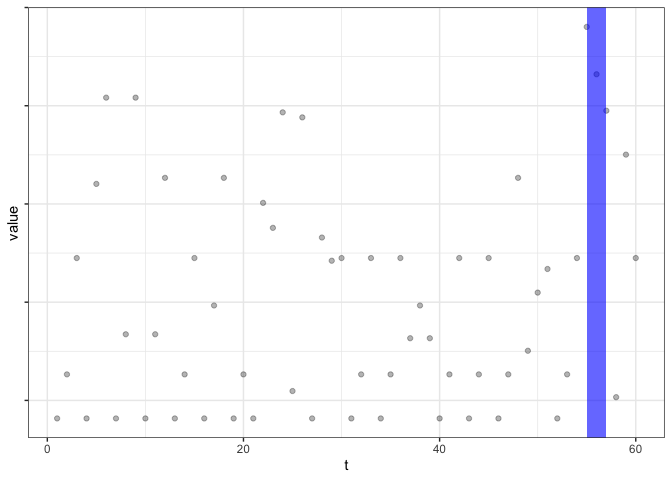
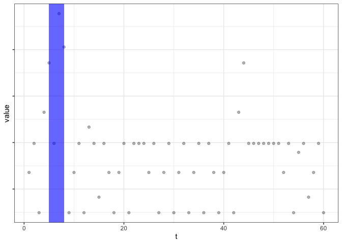

Anomaly detection
================

> Collective And Point Anomaly Detection (CAPA) differentiates between
> collective and point anomalies in univariate time-series data. Global
> and contextual anomalies are single observations that are outliers
> with regards to the complete dataset and their local context
> respectively. Collective anomalies are sequences of observations that
> are not anomalous when considered individually, but together form an
> anomalous pattern (Fisch, Eckley, and Fearnhead 2018).

``` r
library(knitr)
library(dplyr)
library(anomaly)
library(skimr)
library(tidyverse)
```

``` r
load(file="d.Rdata")
```

``` r
d <- d %>%
  group_by(pid) %>%
  mutate(m = 1:n()) %>%
  ungroup()

# There are 10 measurements with missings on passion, I delete these 
d <- d %>%
  filter(!is.na(s.pas))

# Team passion average and SD per measurement
d <- d %>%
  group_by(m, team) %>%
  mutate(sd.pas = sd(s.pas),
         mean.pas = mean(s.pas)) %>%
  ungroup()
```

Select one team to try out

``` r
d_t <- d %>%
  filter(team == 1010) 

# Select data at team-level 
d_t2 <-d_t %>%
  group_by(m) %>%
  slice(1) %>%
  ungroup()
```

CAPA: For the collective anomalies, I select a period of 3 measurement
points (1 day) as the minimum and 9 points (3 days).

``` r
res.1010 <- capa.uv(d_t2$sd.pas, min_seg_len = 3, max_seg_len = 9, type = "mean")
                    
summary(res.1010)
```

    ## Univariate CAPA detecting changes in mean.
    ## observations = 60
    ## minimum segment length = 3
    ## maximum segment length = 9
    ## 
    ## Point anomalies detected : 2
    ##   location variate strength
    ## 1       52       1 11.56921
    ## 2       54       1 11.56921
    ## 
    ## Collective anomalies detected : 3
    ##   start end variate start.lag end.lag mean.change test.statistic
    ## 1    10  12       1         0       0   17.017779       51.05334
    ## 2    34  36       1         0       0   14.169075       42.50723
    ## 3    46  48       1         0       0    5.787324       17.36197

> There are two point anomalies detected (at measurement 52 and 54) and
> three collective anomalies (10-12, 34-36, and 46-48). These stand out
> because within-team passion SD is notably lower than during the rest
> of the study.

Explore this with a plot

``` r
plot(res.1010)
```

<!-- -->

> The blue bars are the collective anomalies, the red dots the point
> anomalies. These are periods or moments where the within-team passion
> SD is lower.

Try another team

``` r
d_t <- d %>%
  filter(team == 1112)

d_t2 <-d_t %>%
  group_by(m) %>%
  slice(1) %>%
  ungroup()

res.1112 <- capa.uv(d_t2$sd.pas, min_seg_len = 3, max_seg_len = 9, type = "mean")
summary(res.1112)
```

    ## Univariate CAPA detecting changes in mean.
    ## observations = 60
    ## minimum segment length = 3
    ## maximum segment length = 9
    ## 
    ## Point anomalies detected : 0
    ## 
    ## Collective anomalies detected : 1
    ##   start end variate start.lag end.lag mean.change test.statistic
    ## 1    55  57       1         0       0    4.917173       14.75152

``` r
plot(res.1112)
```

<!-- -->

> There is 1 collective anomaly.

Try another team

``` r
d_t <- d %>%
  filter(team == 1101)

d_t2 <-d_t %>%
  group_by(m) %>%
  slice(1) %>%
  ungroup()

res.1101 <- capa.uv(d_t2$sd.pas, min_seg_len = 3, max_seg_len = 9,  type = "mean")
summary(res.1101)
```

    ## Univariate CAPA detecting changes in mean.
    ## observations = 60
    ## minimum segment length = 3
    ## maximum segment length = 9
    ## 
    ## Point anomalies detected : 0
    ## 
    ## Collective anomalies detected : 1
    ##   start end variate start.lag end.lag mean.change test.statistic
    ## 1     5   8       1         0       0    3.175399       12.70159

``` r
plot(res.1101)
```

<!-- -->

> There is 1 collective anomaly.
