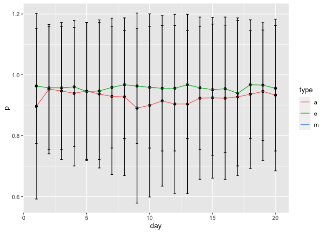
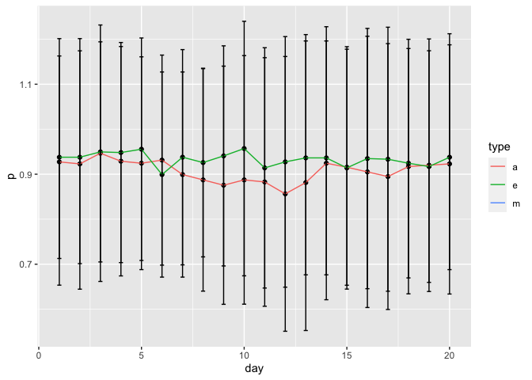
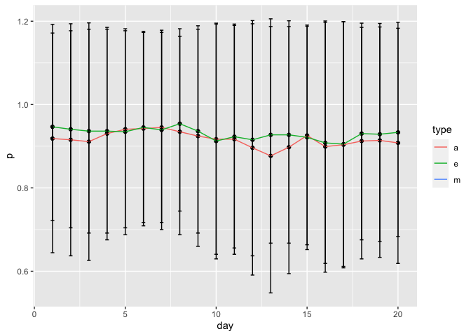
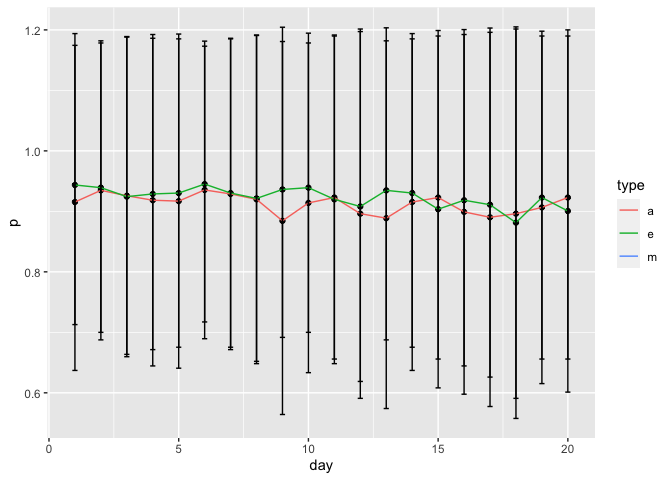
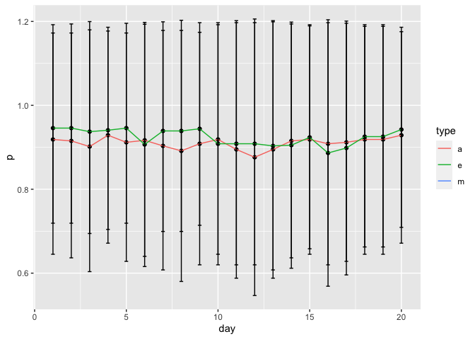
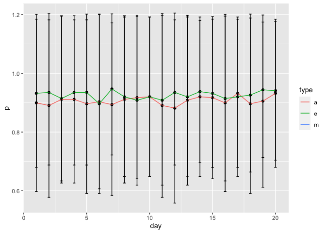
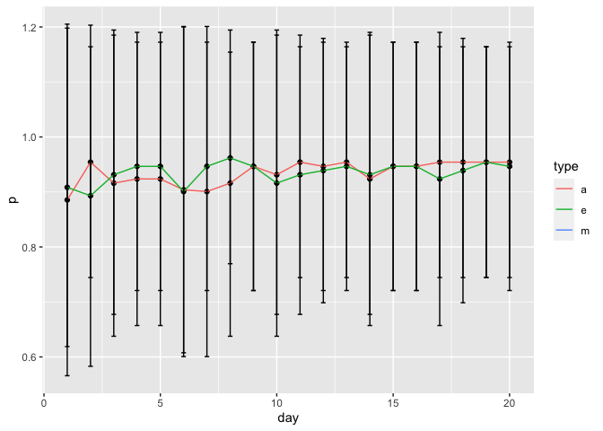

CRRC Interaction variability
================

``` r
library(dplyr)
library(psych)
library(lme4)
library(ggplot2)
```

``` r
load("d.Rdata")
```

Calculate the total number of interaction partners

``` r
d <- d %>%
  rowwise() %>% 
  mutate(s.ip_t = sum(s.ip_1, s.ip_2, s.ip_3, s.ip_4, s.ip_5, s.ip_6, s.ip_7, na.rm=T))
```

Plot mean and sd of total number of interaction partners per day and
type, and for interactions with each individual team member

``` r
#Total
d %>%
  group_by(day, type) %>%
  summarize(p = mean(s.ip_t, na.rm=T),
            q = sd(s.ip_t, na.rm=T)) %>%
  ggplot(aes(x=day, y=p)) + 
  geom_point() + 
  geom_line(aes(group=type, color=type)) +
  geom_errorbar(aes(ymin = p - q, ymax = p + q, width = .2))
```

<!-- -->

``` r
#Team member 1
d %>%
  group_by(day, type) %>%
  summarize(p = mean(s.ip_1, na.rm=T),
            q = sd(s.ip_1, na.rm=T)) %>%
  ggplot(aes(x=day, y=p)) + 
  geom_point() + 
  geom_line(aes(group=type, color=type)) +
  geom_errorbar(aes(ymin = p - q, ymax = p + q, width = .2))
```

    ## Warning: Removed 20 rows containing missing values (geom_point).

    ## Warning: Removed 20 row(s) containing missing values (geom_path).

<!-- -->

``` r
#Team member 2
d %>%
  group_by(day, type) %>%
  summarize(p = mean(s.ip_2, na.rm=T),
            q = sd(s.ip_3, na.rm=T)) %>%
  ggplot(aes(x=day, y=p)) + 
  geom_point() + 
  geom_line(aes(group=type, color=type)) +
  geom_errorbar(aes(ymin = p - q, ymax = p + q, width = .2))
```

    ## Warning: Removed 20 rows containing missing values (geom_point).

    ## Warning: Removed 20 row(s) containing missing values (geom_path).

<!-- -->

``` r
#Team member 3
d %>%
  group_by(day, type) %>%
  summarize(p = mean(s.ip_3, na.rm=T),
            q = sd(s.ip_3, na.rm=T)) %>%
  ggplot(aes(x=day, y=p)) + 
  geom_point() + 
  geom_line(aes(group=type, color=type)) +
  geom_errorbar(aes(ymin = p - q, ymax = p + q, width = .2))
```

    ## Warning: Removed 20 rows containing missing values (geom_point).

    ## Warning: Removed 20 row(s) containing missing values (geom_path).

<!-- -->

``` r
#Team member 4
d %>%
  group_by(day, type) %>%
  summarize(p = mean(s.ip_4, na.rm=T),
            q = sd(s.ip_4, na.rm=T)) %>%
  ggplot(aes(x=day, y=p)) + 
  geom_point() + 
  geom_line(aes(group=type, color=type)) +
  geom_errorbar(aes(ymin = p - q, ymax = p + q, width = .2))
```

    ## Warning: Removed 20 rows containing missing values (geom_point).

    ## Warning: Removed 20 row(s) containing missing values (geom_path).

<!-- -->

``` r
#Team member 5
d %>%
  group_by(day, type) %>%
  summarize(p = mean(s.ip_5, na.rm=T),
            q = sd(s.ip_5, na.rm=T)) %>%
  ggplot(aes(x=day, y=p)) + 
  geom_point() + 
  geom_line(aes(group=type, color=type)) +
  geom_errorbar(aes(ymin = p - q, ymax = p + q, width = .2))
```

    ## Warning: Removed 20 rows containing missing values (geom_point).

    ## Warning: Removed 20 row(s) containing missing values (geom_path).

<!-- -->

``` r
#Team member 6
d %>%
  group_by(day, type) %>%
  summarize(p = mean(s.ip_6, na.rm=T),
            q = sd(s.ip_6, na.rm=T)) %>%
  ggplot(aes(x=day, y=p)) + 
  geom_point() + 
  geom_line(aes(group=type, color=type)) +
  geom_errorbar(aes(ymin = p - q, ymax = p + q, width = .2))
```

    ## Warning: Removed 20 rows containing missing values (geom_point).

    ## Warning: Removed 20 row(s) containing missing values (geom_path).

<!-- -->

``` r
#Team member 7
d %>%
  group_by(day, type) %>%
  summarize(p = mean(s.ip_7, na.rm=T),
            q = sd(s.ip_7, na.rm=T)) %>%
  ggplot(aes(x=day, y=p)) + 
  geom_point() + 
  geom_line(aes(group=type, color=type)) +
  geom_errorbar(aes(ymin = p - q, ymax = p + q, width = .2))
```

    ## Warning: Removed 20 rows containing missing values (geom_point).

    ## Warning: Removed 20 row(s) containing missing values (geom_path).

<!-- -->

Empty multilevel model to estimate within person variance

``` r
#Total 
summary(lmer(s.ip_t ~ 1 + (1 | team) + (1 | pid), data = d))
```

    ## Linear mixed model fit by REML ['lmerMod']
    ## Formula: s.ip_t ~ 1 + (1 | team) + (1 | pid)
    ##    Data: d
    ## 
    ## REML criterion at convergence: 214023.3
    ## 
    ## Scaled residuals: 
    ##     Min      1Q  Median      3Q     Max 
    ## -1.8572 -1.1803  0.5293  0.7557  1.1768 
    ## 
    ## Random effects:
    ##  Groups   Name        Variance Std.Dev.
    ##  pid      (Intercept) 0.0000   0.0000  
    ##  team     (Intercept) 0.3619   0.6016  
    ##  Residual             4.2825   2.0694  
    ## Number of obs: 49740, groups:  pid, 829; team, 155
    ## 
    ## Fixed effects:
    ##             Estimate Std. Error t value
    ## (Intercept)  2.67572    0.04923   54.35
    ## convergence code: 0
    ## boundary (singular) fit: see ?isSingular

``` r
#Team member 1 
summary(lmer(s.ip_1 ~ 1 + (1 | team) + (1 | pid), data = d))
```

    ## Linear mixed model fit by REML ['lmerMod']
    ## Formula: s.ip_1 ~ 1 + (1 | team) + (1 | pid)
    ##    Data: d
    ## 
    ## REML criterion at convergence: -4267.4
    ## 
    ## Scaled residuals: 
    ##     Min      1Q  Median      3Q     Max 
    ## -4.4658  0.0345  0.1326  0.3066  2.0135 
    ## 
    ## Random effects:
    ##  Groups   Name        Variance Std.Dev.
    ##  pid      (Intercept) 0.005928 0.07700 
    ##  team     (Intercept) 0.001764 0.04199 
    ##  Residual             0.047563 0.21809 
    ## Number of obs: 26927, groups:  pid, 677; team, 155
    ## 
    ## Fixed effects:
    ##             Estimate Std. Error t value
    ## (Intercept) 0.940617   0.004707   199.8

``` r
#Team member 2
summary(lmer(s.ip_2 ~ 1 + (1 | team) + (1 | pid), data = d))
```

    ## Linear mixed model fit by REML ['lmerMod']
    ## Formula: s.ip_2 ~ 1 + (1 | team) + (1 | pid)
    ##    Data: d
    ## 
    ## REML criterion at convergence: 4351.4
    ## 
    ## Scaled residuals: 
    ##     Min      1Q  Median      3Q     Max 
    ## -3.7571  0.0580  0.2158  0.3748  1.3286 
    ## 
    ## Random effects:
    ##  Groups   Name        Variance Std.Dev.
    ##  pid      (Intercept) 0.007343 0.08569 
    ##  team     (Intercept) 0.000000 0.00000 
    ##  Residual             0.065969 0.25684 
    ## Number of obs: 26834, groups:  pid, 675; team, 155
    ## 
    ## Fixed effects:
    ##             Estimate Std. Error t value
    ## (Intercept) 0.920387   0.003652     252
    ## convergence code: 0
    ## boundary (singular) fit: see ?isSingular

``` r
#Team member 3
summary(lmer(s.ip_3 ~ 1 + (1 | team) + (1 | pid), data = d))
```

    ## Linear mixed model fit by REML ['lmerMod']
    ## Formula: s.ip_3 ~ 1 + (1 | team) + (1 | pid)
    ##    Data: d
    ## 
    ## REML criterion at convergence: 3807.4
    ## 
    ## Scaled residuals: 
    ##     Min      1Q  Median      3Q     Max 
    ## -3.7849  0.1410  0.2185  0.3734  1.1481 
    ## 
    ## Random effects:
    ##  Groups   Name        Variance  Std.Dev. 
    ##  pid      (Intercept) 6.077e-03 7.795e-02
    ##  team     (Intercept) 7.145e-14 2.673e-07
    ##  Residual             6.488e-02 2.547e-01
    ## Number of obs: 26806, groups:  pid, 674; team, 155
    ## 
    ## Fixed effects:
    ##             Estimate Std. Error t value
    ## (Intercept) 0.923148   0.003382     273
    ## convergence code: 0
    ## boundary (singular) fit: see ?isSingular

``` r
#Team member 4
summary(lmer(s.ip_4 ~ 1 + (1 | team) + (1 | pid), data = d))
```

    ## Linear mixed model fit by REML ['lmerMod']
    ## Formula: s.ip_4 ~ 1 + (1 | team) + (1 | pid)
    ##    Data: d
    ## 
    ## REML criterion at convergence: 5230.1
    ## 
    ## Scaled residuals: 
    ##     Min      1Q  Median      3Q     Max 
    ## -3.6907  0.1372  0.2153  0.3695  1.4468 
    ## 
    ## Random effects:
    ##  Groups   Name        Variance  Std.Dev.
    ##  pid      (Intercept) 0.0069094 0.08312 
    ##  team     (Intercept) 0.0001075 0.01037 
    ##  Residual             0.0682816 0.26131 
    ## Number of obs: 26828, groups:  pid, 674; team, 155
    ## 
    ## Fixed effects:
    ##             Estimate Std. Error t value
    ## (Intercept) 0.917844   0.003677   249.6

``` r
#Team member 5
summary(lmer(s.ip_5 ~ 1 + (1 | team) + (1 | pid), data = d))
```

    ## Linear mixed model fit by REML ['lmerMod']
    ## Formula: s.ip_5 ~ 1 + (1 | team) + (1 | pid)
    ##    Data: d
    ## 
    ## REML criterion at convergence: 3709.8
    ## 
    ## Scaled residuals: 
    ##     Min      1Q  Median      3Q     Max 
    ## -3.8041  0.0697  0.1982  0.3734  1.5981 
    ## 
    ## Random effects:
    ##  Groups   Name        Variance Std.Dev.
    ##  pid      (Intercept) 0.006578 0.08111 
    ##  team     (Intercept) 0.005262 0.07254 
    ##  Residual             0.065350 0.25564 
    ## Number of obs: 23466, groups:  pid, 590; team, 127
    ## 
    ## Fixed effects:
    ##             Estimate Std. Error t value
    ## (Intercept) 0.914594   0.007459   122.6

``` r
#Team member 6
summary(lmer(s.ip_6 ~  + (1 | team) + (1 | pid), data = d))
```

    ## Linear mixed model fit by REML ['lmerMod']
    ## Formula: s.ip_6 ~ +(1 | team) + (1 | pid)
    ##    Data: d
    ## 
    ## REML criterion at convergence: -751.3
    ## 
    ## Scaled residuals: 
    ##     Min      1Q  Median      3Q     Max 
    ## -4.2627  0.0408  0.1321  0.3123  1.9287 
    ## 
    ## Random effects:
    ##  Groups   Name        Variance Std.Dev.
    ##  pid      (Intercept) 0.005383 0.07337 
    ##  team     (Intercept) 0.027007 0.16434 
    ##  Residual             0.052348 0.22880 
    ## Number of obs: 13437, groups:  pid, 338; team, 64
    ## 
    ## Fixed effects:
    ##             Estimate Std. Error t value
    ## (Intercept)  0.90638    0.02103   43.11

``` r
#Team member 7
summary(lmer(s.ip_6 ~  + (1 | team) + (1 | pid), data = d))
```

    ## Linear mixed model fit by REML ['lmerMod']
    ## Formula: s.ip_6 ~ +(1 | team) + (1 | pid)
    ##    Data: d
    ## 
    ## REML criterion at convergence: -751.3
    ## 
    ## Scaled residuals: 
    ##     Min      1Q  Median      3Q     Max 
    ## -4.2627  0.0408  0.1321  0.3123  1.9287 
    ## 
    ## Random effects:
    ##  Groups   Name        Variance Std.Dev.
    ##  pid      (Intercept) 0.005383 0.07337 
    ##  team     (Intercept) 0.027007 0.16434 
    ##  Residual             0.052348 0.22880 
    ## Number of obs: 13437, groups:  pid, 338; team, 64
    ## 
    ## Fixed effects:
    ##             Estimate Std. Error t value
    ## (Intercept)  0.90638    0.02103   43.11
