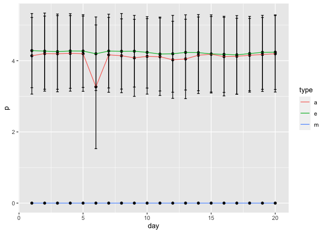

CRRC Interaction variability
================

``` r
library(dplyr)
```

    ## 
    ## Attaching package: 'dplyr'

    ## The following objects are masked from 'package:stats':
    ## 
    ##     filter, lag

    ## The following objects are masked from 'package:base':
    ## 
    ##     intersect, setdiff, setequal, union

``` r
library(psych)
library(lme4)
```

    ## Loading required package: Matrix

``` r
library(ggplot2)
```

    ## 
    ## Attaching package: 'ggplot2'

    ## The following objects are masked from 'package:psych':
    ## 
    ##     %+%, alpha

``` r
load("d.Rdata")
```

Calculate the total number of interaction partners (morning, evening,
day)

``` r
d <- d %>%
  rowwise() %>% 
  mutate(s.ip_t = sum(s.ip_1, s.ip_2, s.ip_3, s.ip_4, s.ip_5, s.ip_6, s.ip_7, na.rm=T))
```

``` r
d %>%
  group_by(day, type) %>%
  summarize(p = mean(s.ip_t, na.rm=T),
            q = sd(s.ip_t, na.rm=T)) %>%
  ggplot(aes(x=day, y=p)) + 
  geom_point() + 
  geom_line(aes(group=type, color=type)) +
  geom_errorbar(aes(ymin = p - q, ymax = p + q, width = .2))
```

    ## `summarise()` regrouping output by 'day' (override with `.groups` argument)

<!-- -->

Empty multilevel model to estimate within person variance

``` r
empty <- lmer(s.ip_t ~ 1 + (1 | team) + (1 | pid), data = d)
```

    ## boundary (singular) fit: see ?isSingular

``` r
summary(empty)
```

    ## Linear mixed model fit by REML ['lmerMod']
    ## Formula: s.ip_t ~ 1 + (1 | team) + (1 | pid)
    ##    Data: d
    ## 
    ## REML criterion at convergence: 214023.3
    ## 
    ## Scaled residuals: 
    ##     Min      1Q  Median      3Q     Max 
    ## -1.8572 -1.1803  0.5293  0.7557  1.1768 
    ## 
    ## Random effects:
    ##  Groups   Name        Variance Std.Dev.
    ##  pid      (Intercept) 0.0000   0.0000  
    ##  team     (Intercept) 0.3619   0.6016  
    ##  Residual             4.2825   2.0694  
    ## Number of obs: 49740, groups:  pid, 829; team, 155
    ## 
    ## Fixed effects:
    ##             Estimate Std. Error t value
    ## (Intercept)  2.67572    0.04923   54.35
    ## convergence code: 0
    ## boundary (singular) fit: see ?isSingular
