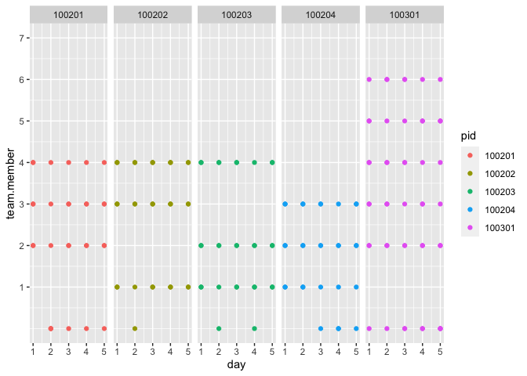

CRRC Interactions per day
================

``` r
library(dplyr)
```

    ## Warning: package 'dplyr' was built under R version 4.0.5

``` r
library(plyr)
library(tidyr)
library(psych)
library(lme4)
library(ggplot2)
```

``` r
load("d.Rdata")
```

Plot: With which team members did the participant interact with each
day? (all forms of communication)

``` r
d$pid <- as.factor(d$pid)

# Change data to longer format so all s.ip variables are in one column
dlonger <- d %>% 
  select(s.ip_1, s.ip_2, s.ip_3, s.ip_4, s.ip_5, s.ip_6, s.ip_7, pid, team, team_size, tid, day, type) %>%
   pivot_longer(s.ip_1:s.ip_7, names_to = "team.member", values_to = "response") %>%
  mutate(team.member = ifelse(response == "1", team.member, 0)) 

# Revalue
dlonger$team.member <- plyr::revalue(dlonger$team.member, c("s.ip_1" = "1", "s.ip_2" = "2", "s.ip_3" = "3", "s.ip_4" = "4", "s.ip_5" = "5", "s.ip_6" = "6", "s.ip_7" = "7"))

dlonger$team.member <- as.numeric(dlonger$team.member)

# Plot first five participants
dlonger %>%
   filter(pid == 100101 | pid == 100102 | pid == 100103 | pid == 100104 | pid == 100105) %>%
   filter(!is.na(response))%>%
   ggplot(aes(x = day, y = team.member, color = pid)) +
   geom_point() + 
   scale_y_continuous(limits = c(0,7), breaks = 1:7) +
   facet_wrap(vars(pid), ncol = 5)
```

<!-- -->

``` r
#Only the five first days
dlonger %>%
   filter(pid == 100101 | pid == 100102 | pid == 100103 | pid == 100104 | pid == 100105) %>%
   filter(!is.na(response))%>%
   filter(day < 6) %>%
   ggplot(aes(x = day, y = team.member, color = pid)) +
   geom_point() + 
   scale_y_continuous(limits = c(0,7), breaks = 1:7) +
   scale_x_continuous(breaks = 1:5) +
   facet_wrap(vars(pid), ncol = 5)
```

<!-- -->

Another group of five participants

``` r
dlonger %>%
   filter(pid == 100201 | pid == 100202 | pid == 100203 | pid == 100204 | pid == 100301) %>%
   filter(!is.na(response))%>%
   ggplot(aes(x = day, y = team.member, color = pid)) +
   geom_point() + 
   scale_y_continuous(limits = c(0,7), breaks = 1:7) +
   facet_wrap(vars(pid), ncol = 5)
```

<!-- -->

``` r
# First five days
dlonger %>%
   filter(pid == 100201 | pid == 100202 | pid == 100203 | pid == 100204 | pid == 100301) %>%
   filter(!is.na(response))%>%
   filter(day < 6) %>%
   ggplot(aes(x = day, y = team.member, color = pid)) +
   geom_point() + 
   scale_y_continuous(limits = c(0,7), breaks = 1:7) +
   scale_x_continuous(breaks = 1:5) +
   facet_wrap(vars(pid), ncol = 5)
```

<!-- -->

What does it look like if we only look at in-person/face to face
interactions?

``` r
#Select in-person interactions
d2 <- d %>%
  mutate(s.ip_1 = ifelse(s.im_1 == 1, 1, NA),
         s.ip_2 = ifelse(s.im_2 == 1, 1, NA),
         s.ip_3 = ifelse(s.im_3 == 1, 1, NA),
         s.ip_4 = ifelse(s.im_4 == 1, 1, NA),
         s.ip_5 = ifelse(s.im_5 == 1, 1, NA),
         s.ip_6 = ifelse(s.im_6 == 1, 1, NA),
         s.ip_7 = ifelse(s.im_7 == 1, 1, NA))

#Create longer dataset
d2$pid <- as.factor(d2$pid)

# Change data to longer format so all s.ip variables are in one column
d2longer <- d2 %>% 
  select(s.ip_1, s.ip_2, s.ip_3, s.ip_4, s.ip_5, s.ip_6, s.ip_7, pid, team, team_size, tid, day, type) %>%
   pivot_longer(s.ip_1:s.ip_7, names_to = "team.member", values_to = "response") %>%
   mutate(team.member = ifelse(response == "1", team.member, 0)) 

# Revalue
d2longer$team.member <- plyr::revalue(d2longer$team.member, c("s.ip_1" = "1", "s.ip_2" = "2", "s.ip_3" = "3", "s.ip_4" = "4", "s.ip_5" = "5", "s.ip_6" = "6", "s.ip_7" = "7"))

d2longer$team.member <- as.numeric(d2longer$team.member)

# Plot first five participants
d2longer %>%
   filter(pid == 100101 | pid == 100102 | pid == 100103 | pid == 100104 | pid == 100105) %>%
   filter(!is.na(response))%>%
   ggplot(aes(x = day, y = team.member, color = pid)) +
   geom_point() + 
   scale_y_continuous(limits = c(0,7), breaks = 1:7) +
   facet_wrap(vars(pid), ncol = 5)
```

<!-- -->

``` r
# First five days
d2longer %>%
   filter(pid == 100101 | pid == 100102 | pid == 100103 | pid == 100104 | pid == 100105) %>%
   filter(!is.na(response))%>%
   filter(day < 6) %>%
   ggplot(aes(x = day, y = team.member, color = pid)) +
   geom_point() + 
   scale_y_continuous(limits = c(0,7), breaks = 1:7) +
   scale_x_continuous(breaks = 1:5) +
   facet_wrap(vars(pid), ncol = 5)
```

<!-- -->

``` r
#Another group of 5 participants
d2longer %>%
   filter(pid == 100201 | pid == 100202 | pid == 100203 | pid == 100204 | pid == 100301) %>%
   filter(!is.na(response))%>%
   ggplot(aes(x = day, y = team.member, color = pid)) +
   geom_point() + 
   scale_y_continuous(limits = c(0,7), breaks = 1:7) +
   facet_wrap(vars(pid), ncol = 5)
```

<!-- -->

``` r
# First five days
d2longer %>%
   filter(pid == 100201 | pid == 100202 | pid == 100203 | pid == 100204 | pid == 100301) %>%
   filter(!is.na(response))%>%
   filter(day < 6) %>%
   ggplot(aes(x = day, y = team.member, color = pid)) +
   geom_point() + 
   scale_y_continuous(limits = c(0,7), breaks = 1:7) +
   scale_x_continuous(breaks = 1:5) +
   facet_wrap(vars(pid), ncol = 5)
```

<!-- -->

What did it look like across days, from assessment to assessment? (all
interactions)

``` r
#Create column to indicate number of assessment (1 = first measurement on day 1, 4 = first measurement on day 2 etc)
d <- d[with(d, order(day, type, pid)),]

d3 <- d %>%
  group_by(pid) %>%
  dplyr::mutate(type2 = 1:n())

#Create longer dataset
d3$pid <- as.factor(d3$pid)

# Change data to longer format so all s.ip variables are in one column
d3longer <- d3 %>% 
  select(s.ip_1, s.ip_2, s.ip_3, s.ip_4, s.ip_5, s.ip_6, s.ip_7, pid, team, team_size, tid, day, type,   
         type2) %>%
   pivot_longer(s.ip_1:s.ip_7, names_to = "team.member", values_to = "response") %>%
  mutate(team.member = ifelse(response == "1", team.member, 0)) 

# Revalue
d3longer$team.member <- plyr::revalue(d3longer$team.member, c("s.ip_1" = "1", "s.ip_2" = "2", "s.ip_3" = "3", "s.ip_4" = "4", "s.ip_5" = "5", "s.ip_6" = "6", "s.ip_7" = "7"))

d3longer$team.member <- as.numeric(d3longer$team.member)

#Plot day 1-3 for the first 5 participants
d3longer %>%
   filter(pid == 100101 | pid == 100102 | pid == 100103 | pid == 100104 | pid == 100105) %>%
   filter(!is.na(response))%>%
   filter(type2 < 10) %>%
   ggplot(aes(x = type2, y = team.member, color = type)) +
   geom_point() + 
   scale_y_continuous(limits = c(0,7), breaks = 1:7) +
   scale_x_continuous(limits = c(1,9), breaks = c(1:9)) +
   xlab("Measurement occasion") + 
   facet_wrap(vars(pid), ncol = 5)
```

<!-- -->

``` r
# Day 4-6 for the first 5 participants
d3longer %>%
   filter(pid == 100101 | pid == 100102 | pid == 100103 | pid == 100104 | pid == 100105) %>%
   filter(!is.na(response))%>%
   filter(type2 > 9 & type2 < 19) %>%
   ggplot(aes(x = type2, y = team.member, color = type)) +
   geom_point() + 
   scale_y_continuous(limits = c(0,7), breaks = 1:7) +
   scale_x_continuous(limits = c(9,18), breaks = c(9:18)) +
   xlab("Measurement occasion") + 
   facet_wrap(vars(pid), ncol = 5)
```

<!-- -->

Another group of 5 participants

``` r
#Day 1-3
d3longer %>%
   filter(pid == 100201 | pid == 100202 | pid == 100203 | pid == 100204 | pid == 100301) %>%
   filter(!is.na(response))%>%
   filter(type2 < 10) %>%
   ggplot(aes(x = type2, y = team.member, color = type)) +
   geom_point() + 
   scale_y_continuous(limits = c(0,7), breaks = 1:7) +
   scale_x_continuous(limits = c(1,9), breaks = c(1:9)) +
   xlab("Measurement occasion") + 
   facet_wrap(vars(pid), ncol = 5)
```

<!-- -->

``` r
#Day 4-6
d3longer %>%
  filter(pid == 100201 | pid == 100202 | pid == 100203 | pid == 100204 | pid == 100301) %>%
   filter(!is.na(response))%>%
   filter(type2 > 9 & type2 < 19) %>%
   ggplot(aes(x = type2, y = team.member, color = type)) +
   geom_point() + 
   scale_y_continuous(limits = c(0,7), breaks = 1:7) +
   scale_x_continuous(limits = c(9,18), breaks = c(9:18)) +
   xlab("Measurement occasion") + 
   facet_wrap(vars(pid), ncol = 5)
```

<!-- -->

What did it look like across days, from assessment to assessment for
in-person interactions only?

``` r
#Create column to indicate number of assessment (1 = first measurement on day 1, 4 = first measurement on day 2 etc)
d <- d[with(d, order(day, type, pid)),]

d4 <- d %>%
  group_by(pid) %>%
  dplyr::mutate(type2 = 1:n())

#Select in-person interactions
d4 <- d4 %>%
  mutate(s.ip_1 = ifelse(s.im_1 == 1, 1, NA),
         s.ip_2 = ifelse(s.im_2 == 1, 1, NA),
         s.ip_3 = ifelse(s.im_3 == 1, 1, NA),
         s.ip_4 = ifelse(s.im_4 == 1, 1, NA),
         s.ip_5 = ifelse(s.im_5 == 1, 1, NA),
         s.ip_6 = ifelse(s.im_6 == 1, 1, NA),
         s.ip_7 = ifelse(s.im_7 == 1, 1, NA))

#Create longer dataset
d4$pid <- as.factor(d4$pid)

# Change data to longer format so all s.ip variables are in one column
d4longer <- d4 %>% 
  select(s.ip_1, s.ip_2, s.ip_3, s.ip_4, s.ip_5, s.ip_6, s.ip_7, pid, team, team_size, tid, day, type,   
         type2) %>%
   pivot_longer(s.ip_1:s.ip_7, names_to = "team.member", values_to = "response") %>%
  mutate(team.member = ifelse(response == "1", team.member, 0)) 

# Revalue
d4longer$team.member <- plyr::revalue(d4longer$team.member, c("s.ip_1" = "1", "s.ip_2" = "2", "s.ip_3" = "3", "s.ip_4" = "4", "s.ip_5" = "5", "s.ip_6" = "6", "s.ip_7" = "7"))

d4longer$team.member <- as.numeric(d4longer$team.member)

#Plot day 1-3 for the first 5 participants
d4longer %>%
   filter(pid == 100101 | pid == 100102 | pid == 100103 | pid == 100104 | pid == 100105) %>%
   filter(!is.na(response))%>%
   filter(type2 < 10) %>%
   ggplot(aes(x = type2, y = team.member, color = type)) +
   geom_point() + 
   scale_y_continuous(limits = c(0,7), breaks = 1:7) +
   scale_x_continuous(limits = c(1,9), breaks = c(1:9)) +
   xlab("Measurement occasion") + 
   facet_wrap(vars(pid), ncol = 5)
```

<!-- -->

``` r
# Day 4-6 for the first 5 participants
d4longer %>%
   filter(pid == 100101 | pid == 100102 | pid == 100103 | pid == 100104 | pid == 100105) %>%
   filter(!is.na(response))%>%
   filter(type2 > 9 & type2 < 19) %>%
   ggplot(aes(x = type2, y = team.member, color = type)) +
   geom_point() + 
   scale_y_continuous(limits = c(0,7), breaks = 1:7) +
   scale_x_continuous(limits = c(9,18), breaks = c(9:18)) +
   xlab("Measurement occasion") + 
   facet_wrap(vars(pid), ncol = 5)
```

<!-- -->

Another group of 5 participants (in-person interactions only)

``` r
#Day 1-3
d4longer %>%
   filter(pid == 100201 | pid == 100202 | pid == 100203 | pid == 100204 | pid == 100301) %>%
   filter(!is.na(response))%>%
   filter(type2 < 10) %>%
   ggplot(aes(x = type2, y = team.member, color = type)) +
   geom_point() + 
   scale_y_continuous(limits = c(0,7), breaks = 1:7) +
   scale_x_continuous(limits = c(1,9), breaks = c(1:9)) +
   xlab("Measurement occasion") + 
   facet_wrap(vars(pid), ncol = 5)
```

<!-- -->

``` r
#Day 4-6
d4longer %>%
  filter(pid == 100201 | pid == 100202 | pid == 100203 | pid == 100204 | pid == 100301) %>%
   filter(!is.na(response))%>%
   filter(type2 > 9 & type2 < 19) %>%
   ggplot(aes(x = type2, y = team.member, color = type)) +
   geom_point() + 
   scale_y_continuous(limits = c(0,7), breaks = 1:7) +
   scale_x_continuous(limits = c(9,18), breaks = c(9:18)) +
   xlab("Measurement occasion") + 
   facet_wrap(vars(pid), ncol = 5)
```

<!-- -->
