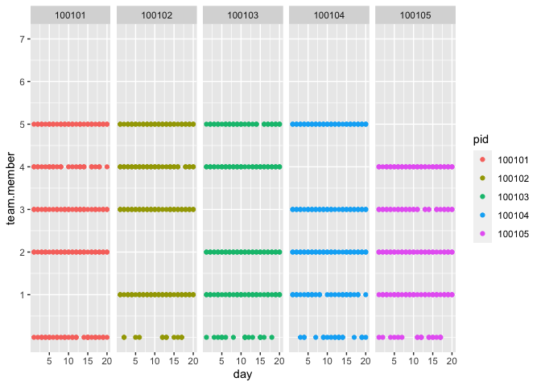
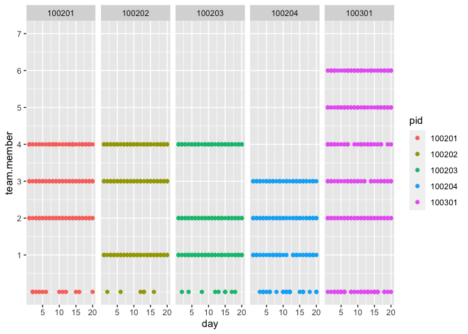

CRRC Interactions per day
================

``` r
library(dplyr)
```

    ## Warning: package 'dplyr' was built under R version 4.0.5

``` r
library(plyr)
library(tidyr)
library(psych)
library(lme4)
library(ggplot2)
```

``` r
load("d.Rdata")
```

Plot: With which team members did the participant interact with each
day?

``` r
d$pid <- as.factor(d$pid)

# Change data to longer format so all s.ip variables are in one column
dlonger <- d %>% 
  select(s.ip_1, s.ip_2, s.ip_3, s.ip_4, s.ip_5, s.ip_6, s.ip_7, pid, team, team_size, tid, day, type) %>%
   pivot_longer(s.ip_1:s.ip_7, names_to = "team.member", values_to = "response") %>%
  mutate(team.member = ifelse(response == "1", team.member, 0)) 

# Revalue
dlonger$team.member <- plyr::revalue(dlonger$team.member, c("s.ip_1" = "1", "s.ip_2" = "2", "s.ip_3" = "3", "s.ip_4" = "4", "s.ip_5" = "5", "s.ip_6" = "6", "s.ip_7" = "7"))

dlonger$team.member <- as.numeric(dlonger$team.member)

# Plot first five participants
dlonger %>%
   filter(pid == 100101 | pid == 100102 | pid == 100103 | pid == 100104 | pid == 100105) %>%
   filter(!is.na(response))%>%
   ggplot(aes(x = day, y = team.member, color = pid)) +
   geom_point() + 
   scale_y_continuous(limits = c(0,7), breaks = 1:7) +
   facet_wrap(vars(pid), ncol = 5)
```

<!-- -->

Additional plot of only the first 5 days

``` r
dlonger %>%
   filter(pid == 100101 | pid == 100102 | pid == 100103 | pid == 100104 | pid == 100105) %>%
   filter(!is.na(response))%>%
   filter(day < 6) %>%
   ggplot(aes(x = day, y = team.member, color = pid)) +
   geom_point() + 
   scale_y_continuous(limits = c(0,7), breaks = 1:7) +
   scale_x_continuous(breaks = 1:5) +
   facet_wrap(vars(pid), ncol = 5)
```

<!-- -->

Another group of five participants

``` r
dlonger %>%
   filter(pid == 100201 | pid == 100202 | pid == 100203 | pid == 100204 | pid == 100301) %>%
   filter(!is.na(response))%>%
   ggplot(aes(x = day, y = team.member, color = pid)) +
   geom_point() + 
   scale_y_continuous(limits = c(0,7), breaks = 1:7) +
   facet_wrap(vars(pid), ncol = 5)
```

<!-- -->

Additional plot of only the first 5 days

``` r
dlonger %>%
   filter(pid == 100201 | pid == 100202 | pid == 100203 | pid == 100204 | pid == 100301) %>%
   filter(!is.na(response))%>%
   filter(day < 6) %>%
   ggplot(aes(x = day, y = team.member, color = pid)) +
   geom_point() + 
   scale_y_continuous(limits = c(0,7), breaks = 1:7) +
   scale_x_continuous(breaks = 1:5) +
   facet_wrap(vars(pid), ncol = 5)
```

<!-- -->
