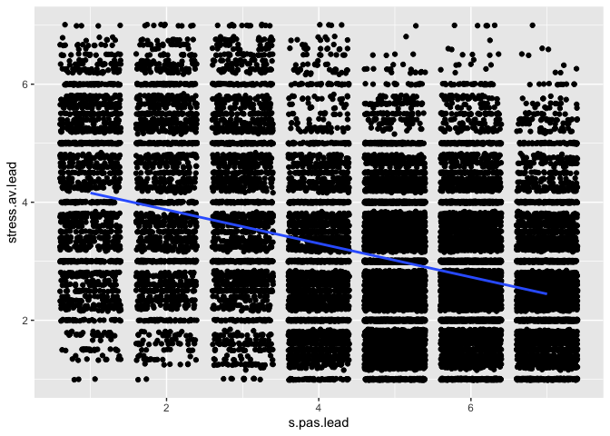

CRRC passion predicted by difference in stress experience - perception
================

``` r
library(dplyr)
```

    ## Warning: package 'dplyr' was built under R version 4.0.5

``` r
library(psych)
library(nlme)
library(ggplot2)
library(effects)
library(correlation)
```

    ## Warning: package 'correlation' was built under R version 4.0.5

``` r
load("/Volumes/Anne/Harvard/Teams/Teams/d.Rdata")
```

Create lead variable for passion and difference scores (i.e. next moment
- current moment)

``` r
d <- d[with(d, order(day, type, pid)),]

d <- d %>%
  group_by(pid) %>%
  mutate(s.pas.lead = lead(s.pas, n=1L)) %>%
  mutate(s.pas.diff = s.pas.lead - s.pas) %>%
  ungroup()

d3 <- d %>%
  select(pid, tid, day, type, s.pas, s.pas.lead, s.pas.diff)
```

Stress perceived by team members in the morning (o.em1)

``` r
d <- d %>%
  group_by(pid, day, type) %>%
    mutate(stress.av = mean(c(o.em1_1, o.em1_2, o.em1_3, o.em1_4, o.em1_5, o.em1_6, o.em1_7), na.rm=T))

d$stress.av[is.nan(d$stress.av)]<-NA
```

Create stress_av lead, this leads the stress_av variable with 1
measurement occasion because other report about the morning is collected
in the afternoon, and other report about the afternoon is collected in
the evening.

``` r
d <- d[with(d, order(day, type, pid)),]

d <- d %>%
  group_by(pid) %>%
  mutate(stress.av.lead = lead(stress.av, n=1L)) %>%
  ungroup()
```

Calculate difference between self-reported stress and other reported
stress

``` r
d <- d %>%
  mutate(stress.diff = s.em1 - stress.av, na.rm=T)

# If stress.diff is positive, this means that I am more stressed than team members think I am
```

Correlation between self- and other reported stress at time t and
passion for work at time t+1

``` r
# Self-report
d %>%
  select(s.em1, s.pas.lead) %>%
  correlation()
```

    ## # Correlation Matrix (pearson-method)
    ## 
    ## Parameter1 | Parameter2 |     r |         95% CI | t(48889) |         p
    ## -----------------------------------------------------------------------
    ## s.em1      | s.pas.lead | -0.27 | [-0.28, -0.26] |   -62.44 | < .001***
    ## 
    ## p-value adjustment method: Holm (1979)
    ## Observations: 48891

``` r
d %>%
  ggplot(aes(x=s.pas.lead, y=s.em1)) + 
  geom_jitter() +
  geom_smooth(method="lm", se=F)
```

    ## `geom_smooth()` using formula 'y ~ x'

    ## Warning: Removed 849 rows containing non-finite values (stat_smooth).

    ## Warning: Removed 849 rows containing missing values (geom_point).

<!-- -->

``` r
# Other report
d %>%
  select(stress.av.lead, s.pas.lead) %>%
  correlation()
```

    ## # Correlation Matrix (pearson-method)
    ## 
    ## Parameter1     | Parameter2 |     r |         95% CI | t(32316) |         p
    ## ---------------------------------------------------------------------------
    ## stress.av.lead | s.pas.lead | -0.38 | [-0.39, -0.37] |   -74.27 | < .001***
    ## 
    ## p-value adjustment method: Holm (1979)
    ## Observations: 32318

``` r
d %>%
  ggplot(aes(x=s.pas.lead, y=stress.av.lead)) + 
  geom_jitter() +
  geom_smooth(method="lm", se=F)
```

    ## `geom_smooth()` using formula 'y ~ x'

    ## Warning: Removed 17422 rows containing non-finite values (stat_smooth).

    ## Warning: Removed 17422 rows containing missing values (geom_point).

<!-- -->

``` r
# Difference between self-report and other report
d %>%
  select(stress.diff, s.pas.lead) %>%
  correlation()
```

    ## # Correlation Matrix (pearson-method)
    ## 
    ## Parameter1  | Parameter2 |     r |         95% CI | t(33139) |         p
    ## ------------------------------------------------------------------------
    ## stress.diff | s.pas.lead | -0.05 | [-0.06, -0.04] |    -9.66 | < .001***
    ## 
    ## p-value adjustment method: Holm (1979)
    ## Observations: 33141

``` r
d %>%
  ggplot(aes(x=s.pas.lead, y=stress.diff)) + 
  geom_jitter() +
  geom_smooth(method="lm", se=F)
```

    ## `geom_smooth()` using formula 'y ~ x'

    ## Warning: Removed 16599 rows containing non-finite values (stat_smooth).

    ## Warning: Removed 16599 rows containing missing values (geom_point).

<!-- -->

How does the difference between self- and other report stress at current
moment predict passion for work at next moment?

``` r
# Random intercept for team and id
model1 <- lme(fixed = s.pas.lead ~ stress.diff,
              random = ~1 | tid/pid,
              data = d,
              na.action = na.omit)

summary(model1)
```

    ## Linear mixed-effects model fit by REML
    ##  Data: d 
    ##      AIC      BIC    logLik
    ##   115047 115089.1 -57518.52
    ## 
    ## Random effects:
    ##  Formula: ~1 | tid
    ##          (Intercept)
    ## StdDev: 0.0003049099
    ## 
    ##  Formula: ~1 | pid %in% tid
    ##         (Intercept) Residual
    ## StdDev:   0.9224753   1.3214
    ## 
    ## Fixed effects: s.pas.lead ~ stress.diff 
    ##                 Value  Std.Error    DF   t-value p-value
    ## (Intercept)  4.964050 0.03285406 32311 151.09397       0
    ## stress.diff -0.037291 0.00570121 32311  -6.54094       0
    ##  Correlation: 
    ##             (Intr)
    ## stress.diff 0.013 
    ## 
    ## Standardized Within-Group Residuals:
    ##        Min         Q1        Med         Q3        Max 
    ## -4.3080110 -0.3982631  0.0969506  0.5596201  3.7969459 
    ## 
    ## Number of Observations: 33141
    ## Number of Groups: 
    ##          tid pid %in% tid 
    ##            7          829

``` r
# Random slopes for team and id
model2 <- lme(fixed = s.pas.lead ~ stress.diff,
              random = ~ stress.diff | tid/pid,
              data = d,
              na.action = na.omit)

summary(model2)
```

    ## Linear mixed-effects model fit by REML
    ##  Data: d 
    ##        AIC      BIC    logLik
    ##   110396.4 110472.1 -55189.19
    ## 
    ## Random effects:
    ##  Formula: ~stress.diff | tid
    ##  Structure: General positive-definite, Log-Cholesky parametrization
    ##             StdDev      Corr  
    ## (Intercept) 0.007508034 (Intr)
    ## stress.diff 0.015701365 0.474 
    ## 
    ##  Formula: ~stress.diff | pid %in% tid
    ##  Structure: General positive-definite, Log-Cholesky parametrization
    ##             StdDev    Corr  
    ## (Intercept) 0.8425525 (Intr)
    ## stress.diff 0.4665675 0.07  
    ## Residual    1.1998005       
    ## 
    ## Fixed effects: s.pas.lead ~ stress.diff 
    ##                 Value  Std.Error    DF   t-value p-value
    ## (Intercept)  4.867788 0.03062677 32311 158.93901   0e+00
    ## stress.diff -0.063901 0.01882148 32311  -3.39513   7e-04
    ##  Correlation: 
    ##             (Intr)
    ## stress.diff 0.09  
    ## 
    ## Standardized Within-Group Residuals:
    ##         Min          Q1         Med          Q3         Max 
    ## -5.48183427 -0.38356929  0.06318773  0.53161172  5.42633291 
    ## 
    ## Number of Observations: 33141
    ## Number of Groups: 
    ##          tid pid %in% tid 
    ##            7          829
