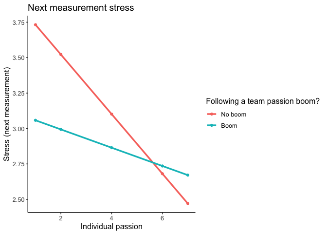
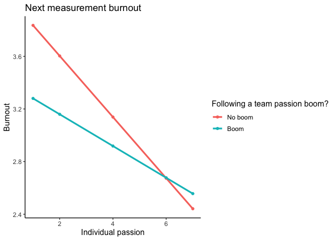
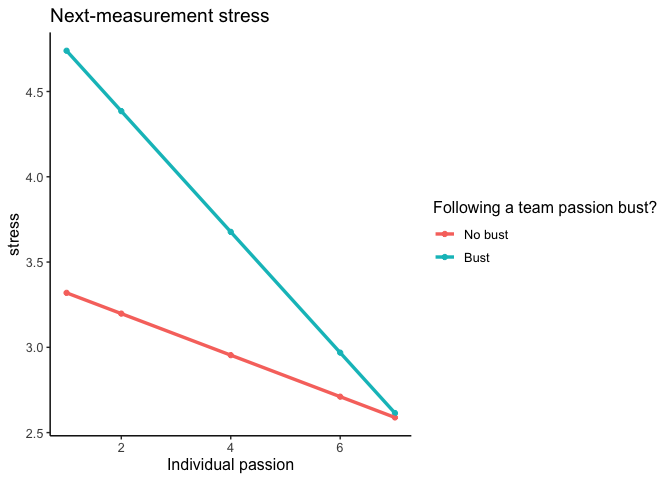
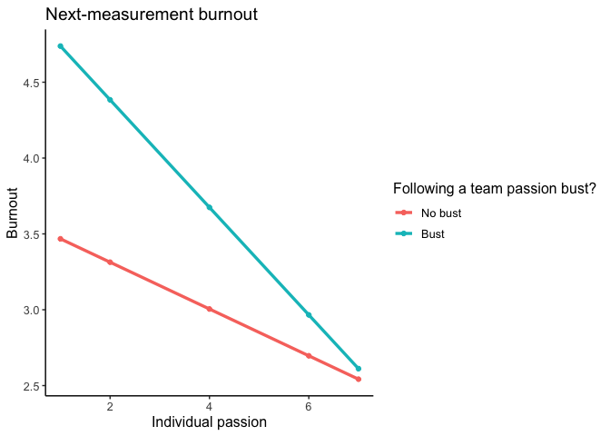

Future stress and burnout from individual passion and booms and busts in
team level passion
================

Does individual passion predict future burnout and stress? Does it
matter if there was a boom or bust in team level passion (interaction
effect individual level passion \* team level passion boom/bust)

``` r
library(knitr)
library(dplyr)
library(anomaly)
library(tidyverse)
library(skimr)
library(nlme)
library(ggplot2)
library(effects)
library(psych)
```

Load anomaly data

``` r
load(file="d.an.Rdata")
```

Lead stress and burnout (next measurement occasion)

``` r
d.an <- d.an %>%
  mutate(stress.l = lead(s.em1, n=1L),
         burnout.l = lead(s.b2, n=1L))
```

Stress predicted by individual-level passion and team-level passion boom

``` r
# Likelihood check
model_1r <- lme(fixed = stress.l ~ s.pas,
                   random = ~1 | team/pid, 
                   data = d.an, 
                   na.action = na.omit, method = "ML")

model_1br <- lme(fixed = stress.l ~ s.pas + boom + s.pas*boom,
                   random = ~1 | team/pid, 
                   data = d.an, 
                   na.action = na.omit, method = "ML")

anova(model_1r, model_1br)
```

    ##           Model df      AIC      BIC    logLik   Test  L.Ratio p-value
    ## model_1r      1  5 174481.5 174525.5 -87235.72                        
    ## model_1br     2  7 174447.3 174509.0 -87216.64 1 vs 2 38.16926  <.0001

``` r
## Second model is best (with interaction)

# Interaction with boom 
model_1b <- lme(fixed = stress.l ~ s.pas + boom + s.pas*boom,
                   random = ~1 | team/pid, 
                   data = d.an, 
                   na.action = na.omit, control = lmeControl(opt = "optim"))

summary(model_1b)
```

    ## Linear mixed-effects model fit by REML
    ##   Data: d.an 
    ##        AIC      BIC    logLik
    ##   174471.1 174532.8 -87228.55
    ## 
    ## Random effects:
    ##  Formula: ~1 | team
    ##         (Intercept)
    ## StdDev:   0.4314333
    ## 
    ##  Formula: ~1 | pid %in% team
    ##         (Intercept) Residual
    ## StdDev:   0.7361223 1.362132
    ## 
    ## Fixed effects:  stress.l ~ s.pas + boom + s.pas * boom 
    ##                 Value  Std.Error    DF   t-value p-value
    ## (Intercept)  3.942186 0.04948874 48897  79.65823       0
    ## s.pas       -0.210163 0.00471055 48897 -44.61542       0
    ## boom        -0.819620 0.13797787 48897  -5.94023       0
    ## s.pas:boom   0.145692 0.02358102 48897   6.17836       0
    ##  Correlation: 
    ##            (Intr) s.pas  boom  
    ## s.pas      -0.471              
    ## boom       -0.061  0.117       
    ## s.pas:boom  0.075 -0.160 -0.965
    ## 
    ## Standardized Within-Group Residuals:
    ##         Min          Q1         Med          Q3         Max 
    ## -4.39681504 -0.62220806 -0.08075832  0.48475652  4.19890289 
    ## 
    ## Number of Observations: 49729
    ## Number of Groups: 
    ##          team pid %in% team 
    ##           155           829

> Higher individual passion predicts lower stress next measurement (main
> effect). Relationship between passion and next-measurement stress is
> less strong if this occurs following a boom (interaction).

Plots for stress (individual passion -\> future stress + BOOM):

``` r
eff <- effect("s.pas:boom", xlevels = list(boom = c(0, 1)), model_1b)

effdata <- as.data.frame(eff)

effdata$boom <- as.factor(effdata$boom)

plot <- ggplot(effdata, aes(x = s.pas, y = fit, color = boom, group = boom)) +
  geom_point() +
  geom_line(size = 1.2) + 
  labs(title = "Next measurement stress", x= "Individual passion", y="Stress (next measurement)", color="Following a team passion boom?", fill="Following a team passion boom") + theme_classic() + theme(text=element_text(size=12)) + 
  scale_fill_discrete(labels = c("No boom", "Boom")) +   scale_color_discrete(labels = c("No boom", "Boom"))

plot
```

<!-- -->

Predicting future burnout from previous passion + BOOM

``` r
# Likelihood check
model_2r <- lme(fixed = burnout.l ~ s.pas,
                   random = ~1 | team/pid, 
                   data = d.an, 
                   na.action = na.omit, method = "ML")

model_2br <- lme(fixed = burnout.l ~ s.pas + boom + s.pas*boom,
                   random = ~1 | team/pid, 
                   data = d.an, 
                   na.action = na.omit, method = "ML")

anova(model_2r, model_2br)
```

    ##           Model df      AIC      BIC    logLik   Test  L.Ratio p-value
    ## model_2r      1  5 178420.3 178464.4 -89205.17                        
    ## model_2br     2  7 178402.7 178464.4 -89194.36 1 vs 2 21.61594  <.0001

``` r
## Second model with interaction is best

## Predicting future burnout from previous passion + interaction with boom 
model_2b <- lme(fixed = burnout.l ~ s.pas + boom + s.pas*boom,
                   random = ~1 | team/pid, 
                   data = d.an, 
                   na.action = na.omit)

summary(model_2b)
```

    ## Linear mixed-effects model fit by REML
    ##   Data: d.an 
    ##        AIC    BIC    logLik
    ##   178426.3 178488 -89206.17
    ## 
    ## Random effects:
    ##  Formula: ~1 | team
    ##         (Intercept)
    ## StdDev:   0.4086645
    ## 
    ##  Formula: ~1 | pid %in% team
    ##         (Intercept) Residual
    ## StdDev:   0.7679864 1.417806
    ## 
    ## Fixed effects:  burnout.l ~ s.pas + boom + s.pas * boom 
    ##                 Value  Std.Error    DF   t-value p-value
    ## (Intercept)  4.067436 0.04931547 48893  82.47789       0
    ## s.pas       -0.232219 0.00490240 48893 -47.36840       0
    ## boom        -0.666716 0.14361414 48893  -4.64241       0
    ## s.pas:boom   0.111631 0.02454459 48893   4.54810       0
    ##  Correlation: 
    ##            (Intr) s.pas  boom  
    ## s.pas      -0.492              
    ## boom       -0.064  0.117       
    ## s.pas:boom  0.079 -0.160 -0.965
    ## 
    ## Standardized Within-Group Residuals:
    ##         Min          Q1         Med          Q3         Max 
    ## -4.02811225 -0.61312208 -0.09946087  0.44689166  4.29916001 
    ## 
    ## Number of Observations: 49725
    ## Number of Groups: 
    ##          team pid %in% team 
    ##           155           829

> Higher individual passion predicts lower burnout next measurement
> (main effect). Burnout is lower following a boom (main effect).
> Relationship between passion and next-measurement burnout is less
> strong if this occurs following a boom (interaction).

Plots for burnout (individual passion -\> future burnout + BOOM):

``` r
eff <- effect("s.pas:boom", xlevels = list(boom = c(0, 1)), model_2b)

effdata <- as.data.frame(eff)

effdata$boom <- as.factor(effdata$boom)

plot <- ggplot(effdata, aes(x = s.pas, y = fit, color = boom, group = boom)) +
  geom_point() +
  geom_line(size = 1.2) + 
  labs(title = "Next measurement burnout", x= "Individual passion", y="Burnout", color="Following a team passion boom?", fill="Following a team passion boom") + theme_classic() + theme(text=element_text(size=12)) + 
  scale_fill_discrete(labels = c("No boom", "Boom")) +   scale_color_discrete(labels = c("No boom", "Boom"))

plot
```

<!-- -->

Stress predicted by individual-level passion and team-level passion BUST

``` r
# Likelihood check
model_3r <- lme(fixed = stress.l ~ s.pas,
                   random = ~1 | team/pid, 
                   data = d.an, 
                   na.action = na.omit, method = "ML")

model_3br <- lme(fixed = stress.l ~ s.pas + bust + s.pas*bust,
                   random = ~1 | team/pid, 
                   data = d.an, 
                   na.action = na.omit, method = "ML")

anova(model_3r, model_3br)
```

    ##           Model df      AIC      BIC    logLik   Test L.Ratio p-value
    ## model_3r      1  5 174481.5 174525.5 -87235.72                       
    ## model_3br     2  7 173276.6 173338.3 -86631.29 1 vs 2 1208.86  <.0001

``` r
## Second model is best

## Predicting future stress from previous passion + interaction with bust 
model_3b <- lme(fixed = stress.l ~ s.pas + bust + s.pas*bust,
                   random = ~1 | team/pid, 
                   data = d.an, 
                   na.action = na.omit, control = lmeControl(opt = "optim"))

summary(model_3b)
```

    ## Linear mixed-effects model fit by REML
    ##   Data: d.an 
    ##        AIC      BIC    logLik
    ##   173302.1 173363.8 -86644.04
    ## 
    ## Random effects:
    ##  Formula: ~1 | team
    ##         (Intercept)
    ## StdDev:   0.4767545
    ## 
    ##  Formula: ~1 | pid %in% team
    ##         (Intercept) Residual
    ## StdDev:   0.7395054 1.345573
    ## 
    ## Fixed effects:  stress.l ~ s.pas + bust + s.pas * bust 
    ##                 Value  Std.Error    DF   t-value p-value
    ## (Intercept)  3.441227 0.05375323 48897  64.01898       0
    ## s.pas       -0.121772 0.00521151 48897 -23.36596       0
    ## bust         1.651818 0.05625317 48897  29.36399       0
    ## s.pas:bust  -0.232277 0.01341019 48897 -17.32095       0
    ##  Correlation: 
    ##            (Intr) s.pas  bust  
    ## s.pas      -0.495              
    ## bust       -0.250  0.477       
    ## s.pas:bust  0.186 -0.376 -0.888
    ## 
    ## Standardized Within-Group Residuals:
    ##         Min          Q1         Med          Q3         Max 
    ## -5.07566866 -0.60805851 -0.06130037  0.48692913  4.17316137 
    ## 
    ## Number of Observations: 49729
    ## Number of Groups: 
    ##          team pid %in% team 
    ##           155           829

> Higher individual passion predicts lower stress next measurement (main
> effect). Stress is higher following a team passion bust. Relationship
> between passion and next-measurement stress is stronger if this occurs
> following a bust (interaction).

Plots for stress (individual passion -\> future stress + BUST):

``` r
eff <- effect("s.pas:bust", xlevels = list(bust = c(0, 1)), model_3b)

effdata <- as.data.frame(eff)

effdata$bust <- as.factor(effdata$bust)

plot <- ggplot(effdata, aes(x = s.pas, y = fit, color = bust, group = bust)) +
  geom_point() +
  geom_line(size = 1.2) + 
  labs(title = "Next-measurement stress", x= "Individual passion", y="stress", color="Following a team passion bust?", fill="Following a team passion bust?") + theme_classic() + theme(text=element_text(size=12)) + 
  scale_fill_discrete(labels = c("No bust", "Bust")) +   scale_color_discrete(labels = c("No bust", "Bust"))

plot
```

<!-- -->

Burnout predicted by individual-level passion and team-level passion
BUST

``` r
# Likelihood check
model_4r <- lme(fixed = burnout.l ~ s.pas,
                   random = ~1 | team/pid, 
                   data = d.an, 
                   na.action = na.omit, method = "ML")

model_4br <- lme(fixed = burnout.l ~ s.pas + bust + s.pas*bust,
                   random = ~1 | team/pid, 
                   data = d.an, 
                   na.action = na.omit, method = "ML")

anova(model_4r, model_4br)
```

    ##           Model df      AIC      BIC    logLik   Test  L.Ratio p-value
    ## model_4r      1  5 178420.3 178464.4 -89205.17                        
    ## model_4br     2  7 177507.9 177569.6 -88746.97 1 vs 2 916.4112  <.0001

``` r
## Second model is best

## Predicting next-measurement burnout from previous passion + interaction with bust 
model_4b <- lme(fixed = burnout.l ~ s.pas + bust + s.pas*bust,
                   random = ~1 | team/pid, 
                   data = d.an, 
                   na.action = na.omit, control = lmeControl(opt = "optim"))

summary(model_4b)
```

    ## Linear mixed-effects model fit by REML
    ##   Data: d.an 
    ##        AIC      BIC    logLik
    ##   177533.2 177594.9 -88759.62
    ## 
    ## Random effects:
    ##  Formula: ~1 | team
    ##         (Intercept)
    ## StdDev:   0.4471992
    ## 
    ##  Formula: ~1 | pid %in% team
    ##         (Intercept) Residual
    ## StdDev:   0.7725448 1.404541
    ## 
    ## Fixed effects:  burnout.l ~ s.pas + bust + s.pas * bust 
    ##                 Value  Std.Error    DF   t-value p-value
    ## (Intercept)  3.621830 0.05329575 48893  67.95720       0
    ## s.pas       -0.154233 0.00543870 48893 -28.35850       0
    ## bust         1.470773 0.05871685 48893  25.04857       0
    ## s.pas:bust  -0.200211 0.01399726 48893 -14.30358       0
    ##  Correlation: 
    ##            (Intr) s.pas  bust  
    ## s.pas      -0.522              
    ## bust       -0.263  0.477       
    ## s.pas:bust  0.196 -0.376 -0.888
    ## 
    ## Standardized Within-Group Residuals:
    ##         Min          Q1         Med          Q3         Max 
    ## -4.31857493 -0.60573100 -0.09198677  0.45345784  4.13425502 
    ## 
    ## Number of Observations: 49725
    ## Number of Groups: 
    ##          team pid %in% team 
    ##           155           829

> Higher individual passion predicts lower burnout next measurement
> (main effect). Burnout is higher following a bust. Relationship
> between passion and next-measurement burnout is stronger if this
> occurs following a bust (interaction).

Plots for burnout (individual passion -\> next measurement burnout +
BUST):

``` r
eff <- effect("s.pas:bust", xlevels = list(bust = c(0, 1)), model_4b)

effdata <- as.data.frame(eff)

effdata$bust <- as.factor(effdata$bust)

plot <- ggplot(effdata, aes(x = s.pas, y = fit, color = bust, group = bust)) +
  geom_point() +
  geom_line(size = 1.2) + 
  labs(title = "Next-measurement burnout", x= "Individual passion", y="Burnout", color="Following a team passion bust?", fill="Following a team passion bust?") + theme_classic() + theme(text=element_text(size=12)) + 
  scale_fill_discrete(labels = c("No bust", "Bust")) +   scale_color_discrete(labels = c("No bust", "Bust"))

plot
```

<!-- -->
