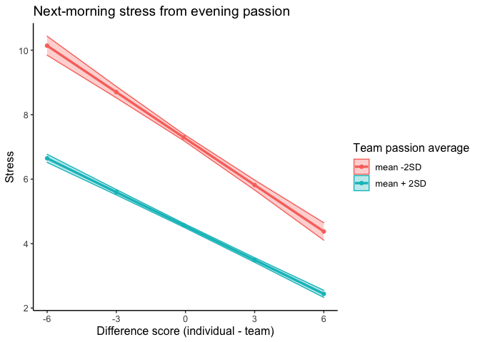
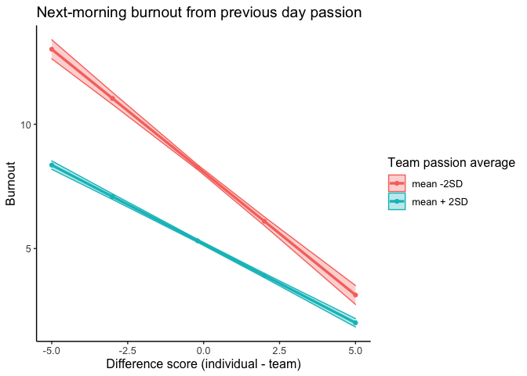

Individual vs. team average (difference scores)
================

``` r
library(knitr)
library(dplyr)
library(tidyverse)
library(nlme)
library(lattice)
library(skimr)
library(ggplot2)
library(effects)
library(psych)
```

``` r
load(file="d.Rdata")
```

Team average excluding individual average (i.e., average of all team
members except participant)

``` r
d <- d %>%
  group_by(pid) %>%
  mutate(m = 1:n()) %>%
  ungroup()

# Momentary team average excluding the reporting participant (mean.pas.2), i.e. average of all teambers except me
d <- d %>%
  group_by(team, day, type) %>%
  mutate(mean.pas.2 = (sum(s.pas) - s.pas) / (team_size - 1)) %>%
  ungroup()

# Daily team average excluding the reporting participant (mean.pas.3)
d <- d %>%
  group_by(team, day) %>%
  mutate(mean.pas.3 = mean(mean.pas.2)) %>%
  ungroup()

# Daily individual average
d <- d %>%
  group_by(day, pid) %>%
  mutate(mean.pas.i = mean(s.pas)) %>%
  ungroup()
```

Difference score passion (individual - team average) \>0 means my score
is greater than my team average)

``` r
# Momentary (s.pas.dev)
d <- d %>%
  mutate(s.pas.dev = s.pas - mean.pas.2)

# Daily (s.pas.dev.d)
d <- d %>%
  mutate(s.pas.dev.d = mean.pas.i - mean.pas.3)
```

Next morning stress (stress.m), burnout (burnout.m) and next day working
hours (s.wl2.l) and workload (s.wl1.l)

``` r
d <- d %>%
  mutate(stress.m = lead(s.em1, n=1L),
         burnout.m = lead(s.b2, 1L),
         s.wl1.l = lead(s.wl1, n=3L),
         s.wl2.l = lead(s.wl2, n=3L))

# Select only evening measurements
d2 <- d %>%
  filter(type == "e")
```

## Predicting next-morning stress from (previous) evening passion

``` r
model_1 <- lme(fixed = stress.m ~ s.pas.dev + mean.pas.2,
                   random = ~1 | team/pid, 
                   data = d2, 
                   na.action = na.omit)

summary(model_1)
```

    ## Linear mixed-effects model fit by REML
    ##   Data: d2 
    ##        AIC     BIC   logLik
    ##   54218.61 54264.9 -27103.3
    ## 
    ## Random effects:
    ##  Formula: ~1 | team
    ##         (Intercept)
    ## StdDev:   0.4141977
    ## 
    ##  Formula: ~1 | pid %in% team
    ##         (Intercept) Residual
    ## StdDev:   0.9213433  1.15869
    ## 
    ## Fixed effects:  stress.m ~ s.pas.dev + mean.pas.2 
    ##                 Value  Std.Error    DF   t-value p-value
    ## (Intercept)  5.869581 0.07697907 15743  76.24905       0
    ## s.pas.dev   -0.280720 0.00817426 15743 -34.34195       0
    ## mean.pas.2  -0.630799 0.01245676 15743 -50.63904       0
    ##  Correlation: 
    ##            (Intr) s.ps.d
    ## s.pas.dev  -0.228       
    ## mean.pas.2 -0.790  0.285
    ## 
    ## Standardized Within-Group Residuals:
    ##         Min          Q1         Med          Q3         Max 
    ## -6.49452622 -0.47392369 -0.05840326  0.34440313  5.34665986 
    ## 
    ## Number of Observations: 16574
    ## Number of Groups: 
    ##          team pid %in% team 
    ##           155           829

``` r
# Interaction
model_1b <- lme(fixed = stress.m ~ s.pas.dev + mean.pas.2 + s.pas.dev*mean.pas.2,
                   random = ~1 | team/pid, 
                   data = d2, 
                   na.action = na.omit)

summary(model_1b)
```

    ## Linear mixed-effects model fit by REML
    ##   Data: d2 
    ##        AIC      BIC    logLik
    ##   54207.65 54261.66 -27096.83
    ## 
    ## Random effects:
    ##  Formula: ~1 | team
    ##         (Intercept)
    ## StdDev:   0.4164012
    ## 
    ##  Formula: ~1 | pid %in% team
    ##         (Intercept) Residual
    ## StdDev:    0.917264 1.158147
    ## 
    ## Fixed effects:  stress.m ~ s.pas.dev + mean.pas.2 + s.pas.dev * mean.pas.2 
    ##                          Value  Std.Error    DF   t-value p-value
    ## (Intercept)           5.900864 0.07727459 15742  76.36229       0
    ## s.pas.dev            -0.415388 0.03037980 15742 -13.67315       0
    ## mean.pas.2           -0.634479 0.01247683 15742 -50.85261       0
    ## s.pas.dev:mean.pas.2  0.030362 0.00659585 15742   4.60318       0
    ##  Correlation: 
    ##                      (Intr) s.ps.d mn.p.2
    ## s.pas.dev            -0.146              
    ## mean.pas.2           -0.791  0.138       
    ## s.pas.dev:mean.pas.2  0.088 -0.963 -0.064
    ## 
    ## Standardized Within-Group Residuals:
    ##         Min          Q1         Med          Q3         Max 
    ## -6.48784630 -0.47498256 -0.06028462  0.33947352  5.34930537 
    ## 
    ## Number of Observations: 16574
    ## Number of Groups: 
    ##          team pid %in% team 
    ##           155           829

``` r
# Likelihood check
model_1r <- lme(fixed = stress.m ~ s.pas.dev + mean.pas.2,
                   random = ~1 | team/pid, 
                   data = d2, 
                   na.action = na.omit, method = "ML")

model_1br <- lme(fixed = stress.m ~ s.pas.dev + mean.pas.2 + s.pas.dev*mean.pas.2,
                   random = ~1 | team/pid, 
                   data = d2, 
                   na.action = na.omit, method = "ML")

anova(model_1r, model_1br)
```

    ##           Model df      AIC      BIC    logLik   Test  L.Ratio p-value
    ## model_1r      1  6 54199.54 54245.83 -27093.77                        
    ## model_1br     2  7 54180.38 54234.39 -27083.19 1 vs 2 21.16032  <.0001

> A positive deviation of the team passion level (scoring higher) at the
> end of the day predicts lower stress the next morning. There is a
> significant interaction effect but too small to be important.

Plots for stress (evening passion -> next morning stress):

``` r
describe(d$mean.pas.2)
```

    ##    vars     n mean   sd median trimmed  mad min max range  skew kurtosis se
    ## X1    1 49686 4.96 1.07    5.2    5.06 0.89   1   7     6 -0.92      0.8  0

``` r
#sd = 1.07 --> 2*1.07 = 2.14

eff <- effect("s.pas.dev:mean.pas.2", xlevels = list(mean.pas.2 = c(-2.14, 2.14)), model_1b)

effdata <- as.data.frame(eff)

effdata$mean.pas.2 <- as.factor(effdata$mean.pas.2)

plot <- ggplot(effdata, aes(x = s.pas.dev, y = fit, color = mean.pas.2, group = mean.pas.2)) +
  geom_point() +
  geom_line(size = 1.2) + 
  geom_ribbon(aes(ymin=fit-se, ymax=fit+se, fill=mean.pas.2),alpha=0.3) +
  labs(title = "Next-morning stress from evening passion", x= "Difference score (individual - team)", y="Stress", color="Team passion average", fill="Team passion average") + theme_classic() + theme(text=element_text(size=12)) + 
  scale_fill_discrete(labels = c("mean -2SD", "mean + 2SD")) +   scale_color_discrete(labels = c("mean -2SD", "mean + 2SD"))

plot
```

<!-- -->

## Predicting next-morning stress from (previous) daily average passion

``` r
model_2 <- lme(fixed = stress.m ~ s.pas.dev.d + mean.pas.3,
                   random = ~1 | team/pid, 
                   data = d2, 
                   na.action = na.omit)

summary(model_2)
```

    ## Linear mixed-effects model fit by REML
    ##   Data: d2 
    ##        AIC      BIC    logLik
    ##   53172.59 53218.86 -26580.29
    ## 
    ## Random effects:
    ##  Formula: ~1 | team
    ##         (Intercept)
    ## StdDev:   0.3737774
    ## 
    ##  Formula: ~1 | pid %in% team
    ##         (Intercept) Residual
    ## StdDev:    0.915121 1.127199
    ## 
    ## Fixed effects:  stress.m ~ s.pas.dev.d + mean.pas.3 
    ##                 Value  Std.Error    DF   t-value p-value
    ## (Intercept)  6.306113 0.07699960 15695  81.89800       0
    ## s.pas.dev.d -0.332339 0.01120775 15695 -29.65262       0
    ## mean.pas.3  -0.708514 0.01263753 15695 -56.06428       0
    ##  Correlation: 
    ##             (Intr) s.ps..
    ## s.pas.dev.d -0.003       
    ## mean.pas.3  -0.814 -0.001
    ## 
    ## Standardized Within-Group Residuals:
    ##         Min          Q1         Med          Q3         Max 
    ## -6.91718784 -0.47342274 -0.04043727  0.35174940  5.24954052 
    ## 
    ## Number of Observations: 16526
    ## Number of Groups: 
    ##          team pid %in% team 
    ##           155           829

``` r
# Interaction
model_2b <- lme(fixed = stress.m ~ s.pas.dev.d + mean.pas.3 + s.pas.dev.d*mean.pas.3,
                   random = ~1 | team/pid, 
                   data = d2, 
                   na.action = na.omit)

summary(model_2b)
```

    ## Linear mixed-effects model fit by REML
    ##   Data: d2 
    ##        AIC      BIC    logLik
    ##   53134.66 53188.65 -26560.33
    ## 
    ## Random effects:
    ##  Formula: ~1 | team
    ##         (Intercept)
    ## StdDev:   0.3752364
    ## 
    ##  Formula: ~1 | pid %in% team
    ##         (Intercept) Residual
    ## StdDev:   0.9089251 1.125875
    ## 
    ## Fixed effects:  stress.m ~ s.pas.dev.d + mean.pas.3 + s.pas.dev.d * mean.pas.3 
    ##                            Value  Std.Error    DF   t-value p-value
    ## (Intercept)             6.310570 0.07689726 15694  82.06495       0
    ## s.pas.dev.d            -0.680528 0.05194408 15694 -13.10116       0
    ## mean.pas.3             -0.709213 0.01262286 15694 -56.18480       0
    ## s.pas.dev.d:mean.pas.3  0.078229 0.01139465 15694   6.86544       0
    ##  Correlation: 
    ##                        (Intr) s.ps.. mn.p.3
    ## s.pas.dev.d            -0.009              
    ## mean.pas.3             -0.814  0.008       
    ## s.pas.dev.d:mean.pas.3  0.009 -0.977 -0.008
    ## 
    ## Standardized Within-Group Residuals:
    ##         Min          Q1         Med          Q3         Max 
    ## -6.87582464 -0.47499215 -0.03974465  0.35038366  5.26579080 
    ## 
    ## Number of Observations: 16526
    ## Number of Groups: 
    ##          team pid %in% team 
    ##           155           829

``` r
# Likelihood check
model_2r <- lme(fixed = stress.m ~ s.pas.dev.d + mean.pas.3,
                   random = ~1 | team/pid, 
                   data = d2, 
                   na.action = na.omit, method = "ML")

model_2br <- lme(fixed = stress.m ~ s.pas.dev.d + mean.pas.3 + s.pas.dev.d*mean.pas.3,
                   random = ~1 | team/pid, 
                   data = d2, 
                   na.action = na.omit, method = "ML")

anova(model_2r, model_2br)
```

    ##           Model df      AIC      BIC    logLik   Test  L.Ratio p-value
    ## model_2r      1  6 53154.16 53200.43 -26571.08                        
    ## model_2br     2  7 53109.11 53163.10 -26547.56 1 vs 2 47.04362  <.0001

> Results are similar but more pronounced. If my daily passion average
> is higher than my team, my next morning stress is lower. Effect is
> slighly stronger when team passion average is higher.

## Predicting next-morning burnout from (previous) evening passion

``` r
model_3 <- lme(fixed = burnout.m ~ s.pas.dev + mean.pas.2,
                   random = ~1 | team/pid, 
                   data = d2, 
                   na.action = na.omit)

summary(model_3)
```

    ## Linear mixed-effects model fit by REML
    ##   Data: d2 
    ##       AIC     BIC    logLik
    ##   54733.1 54779.4 -27360.55
    ## 
    ## Random effects:
    ##  Formula: ~1 | team
    ##         (Intercept)
    ## StdDev:   0.3503342
    ## 
    ##  Formula: ~1 | pid %in% team
    ##         (Intercept) Residual
    ## StdDev:    1.037054 1.172516
    ## 
    ## Fixed effects:  burnout.m ~ s.pas.dev + mean.pas.2 
    ##                 Value  Std.Error    DF   t-value p-value
    ## (Intercept)  6.104918 0.07726728 15741  79.01040       0
    ## s.pas.dev   -0.329698 0.00831213 15741 -39.66465       0
    ## mean.pas.2  -0.673908 0.01260040 15741 -53.48301       0
    ##  Correlation: 
    ##            (Intr) s.ps.d
    ## s.pas.dev  -0.228       
    ## mean.pas.2 -0.796  0.284
    ## 
    ## Standardized Within-Group Residuals:
    ##         Min          Q1         Med          Q3         Max 
    ## -6.56905454 -0.45988446 -0.06474747  0.34105198  6.23305330 
    ## 
    ## Number of Observations: 16572
    ## Number of Groups: 
    ##          team pid %in% team 
    ##           155           829

``` r
# Interaction
model_3b <- lme(fixed = burnout.m ~ s.pas.dev + mean.pas.2 + s.pas.dev*mean.pas.2,
                   random = ~1 | team/pid, 
                   data = d2, 
                   na.action = na.omit)

summary(model_3b)
```

    ## Linear mixed-effects model fit by REML
    ##   Data: d2 
    ##        AIC      BIC    logLik
    ##   54721.82 54775.83 -27353.91
    ## 
    ## Random effects:
    ##  Formula: ~1 | team
    ##         (Intercept)
    ## StdDev:   0.3541748
    ## 
    ##  Formula: ~1 | pid %in% team
    ##         (Intercept) Residual
    ## StdDev:    1.032263 1.171961
    ## 
    ## Fixed effects:  burnout.m ~ s.pas.dev + mean.pas.2 + s.pas.dev * mean.pas.2 
    ##                          Value  Std.Error    DF   t-value p-value
    ## (Intercept)           6.137175 0.07759246 15740  79.09499       0
    ## s.pas.dev            -0.467517 0.03087589 15740 -15.14182       0
    ## mean.pas.2           -0.677724 0.01262165 15740 -53.69535       0
    ## s.pas.dev:mean.pas.2  0.031091 0.00670746 15740   4.63529       0
    ##  Correlation: 
    ##                      (Intr) s.ps.d mn.p.2
    ## s.pas.dev            -0.147              
    ## mean.pas.2           -0.796  0.138       
    ## s.pas.dev:mean.pas.2  0.089 -0.963 -0.065
    ## 
    ## Standardized Within-Group Residuals:
    ##         Min          Q1         Med          Q3         Max 
    ## -6.56265854 -0.45880569 -0.06496021  0.34098749  6.13708451 
    ## 
    ## Number of Observations: 16572
    ## Number of Groups: 
    ##          team pid %in% team 
    ##           155           829

``` r
# Likelihood check
model_3r <- lme(fixed = burnout.m ~ s.pas.dev + mean.pas.2,
                   random = ~1 | team/pid, 
                   data = d2, 
                   na.action = na.omit, method = "ML")

model_3br <- lme(fixed = burnout.m ~ s.pas.dev + mean.pas.2 + s.pas.dev*mean.pas.2,
                   random = ~1 | team/pid, 
                   data = d2, 
                   na.action = na.omit, method = "ML")

anova(model_3r, model_3br)
```

    ##           Model df      AIC      BIC    logLik   Test  L.Ratio p-value
    ## model_3r      1  6 54714.08 54760.37 -27351.04                        
    ## model_3br     2  7 54694.63 54748.63 -27340.31 1 vs 2 21.45204  <.0001

> Results are similar to the results found for stress: If my evening
> passion is higher than my team’s average, my next morning burnout is
> lower. Effect is slighly stronger when team passion average is lower

## Predicting next-morning burnout from (previous) daily average passion

``` r
model_4 <- lme(fixed = burnout.m ~ s.pas.dev.d + mean.pas.3,
                   random = ~1 | team/pid, 
                   data = d2, 
                   na.action = na.omit)

summary(model_4)
```

    ## Linear mixed-effects model fit by REML
    ##   Data: d2 
    ##        AIC      BIC    logLik
    ##   53474.49 53520.77 -26731.25
    ## 
    ## Random effects:
    ##  Formula: ~1 | team
    ##         (Intercept)
    ## StdDev:   0.3091239
    ## 
    ##  Formula: ~1 | pid %in% team
    ##         (Intercept) Residual
    ## StdDev:    1.027338   1.1333
    ## 
    ## Fixed effects:  burnout.m ~ s.pas.dev.d + mean.pas.3 
    ##                 Value  Std.Error    DF   t-value p-value
    ## (Intercept)  6.625263 0.07712429 15691  85.90371       0
    ## s.pas.dev.d -0.392807 0.01132994 15691 -34.66984       0
    ## mean.pas.3  -0.767599 0.01270384 15691 -60.42260       0
    ##  Correlation: 
    ##             (Intr) s.ps..
    ## s.pas.dev.d -0.003       
    ## mean.pas.3  -0.817  0.000
    ## 
    ## Standardized Within-Group Residuals:
    ##         Min          Q1         Med          Q3         Max 
    ## -7.09680996 -0.46279953 -0.04739733  0.35121579  6.94583737 
    ## 
    ## Number of Observations: 16522
    ## Number of Groups: 
    ##          team pid %in% team 
    ##           155           829

``` r
# Interaction
model_4b <- lme(fixed = burnout.m ~ s.pas.dev.d + mean.pas.3 + s.pas.dev.d*mean.pas.3,
                   random = ~1 | team/pid, 
                   data = d2, 
                   na.action = na.omit)

summary(model_4b)
```

    ## Linear mixed-effects model fit by REML
    ##   Data: d2 
    ##       AIC      BIC    logLik
    ##   53416.9 53470.89 -26701.45
    ## 
    ## Random effects:
    ##  Formula: ~1 | team
    ##         (Intercept)
    ## StdDev:   0.3121359
    ## 
    ##  Formula: ~1 | pid %in% team
    ##         (Intercept) Residual
    ## StdDev:    1.020197 1.131271
    ## 
    ## Fixed effects:  burnout.m ~ s.pas.dev.d + mean.pas.3 + s.pas.dev.d * mean.pas.3 
    ##                            Value  Std.Error    DF   t-value p-value
    ## (Intercept)             6.630738 0.07699809 15690  86.11561       0
    ## s.pas.dev.d            -0.811522 0.05245280 15690 -15.47147       0
    ## mean.pas.3             -0.768462 0.01268165 15690 -60.59639       0
    ## s.pas.dev.d:mean.pas.3  0.094135 0.01151359 15690   8.17597       0
    ##  Correlation: 
    ##                        (Intr) s.ps.. mn.p.3
    ## s.pas.dev.d            -0.009              
    ## mean.pas.3             -0.817  0.008       
    ## s.pas.dev.d:mean.pas.3  0.009 -0.976 -0.008
    ## 
    ## Standardized Within-Group Residuals:
    ##         Min          Q1         Med          Q3         Max 
    ## -7.05139865 -0.45367713 -0.04806535  0.35446786  6.85410525 
    ## 
    ## Number of Observations: 16522
    ## Number of Groups: 
    ##          team pid %in% team 
    ##           155           829

``` r
# Likelihood check
model_4r <- lme(fixed = burnout.m ~ s.pas.dev.d + mean.pas.3,
                   random = ~1 | team/pid, 
                   data = d2, 
                   na.action = na.omit, method = "ML")

model_4br <- lme(fixed = burnout.m ~ s.pas.dev.d + mean.pas.3 + s.pas.dev.d*mean.pas.3,
                   random = ~1 | team/pid, 
                   data = d2, 
                   na.action = na.omit, method = "ML")

anova(model_4r, model_4br)
```

    ##           Model df      AIC      BIC    logLik   Test  L.Ratio p-value
    ## model_4r      1  6 53456.09 53502.36 -26722.04                        
    ## model_4br     2  7 53391.39 53445.38 -26688.70 1 vs 2 66.69506  <.0001

> Once again similar results: looking at daily averages, if my daily
> passion average is higher than my team, my burnout levels are lower
> the next morning. Effect is slighly stronger when team passion average
> is lower.

Plots for burnout (daily passion -> next morning burnout):

``` r
describe(d$mean.pas.3)
```

    ##    vars     n mean   sd median trimmed mad  min max range skew kurtosis se
    ## X1    1 49578 4.96 0.94   5.07    5.06 0.8 1.25   7  5.75   -1     1.14  0

``` r
#sd = 0.94 --> 2*0.94 = 1.88

eff <- effect("s.pas.dev.d:mean.pas.3", xlevels = list(mean.pas.3 = c(-1.88, 1.88)), model_4b)

effdata <- as.data.frame(eff)

effdata$mean.pas.3 <- as.factor(effdata$mean.pas.3)

plot <- ggplot(effdata, aes(x = s.pas.dev.d, y = fit, color = mean.pas.3, group = mean.pas.3)) +
  geom_point() +
  geom_line(size = 1.2) + 
  geom_ribbon(aes(ymin=fit-se, ymax=fit+se, fill=mean.pas.3),alpha=0.3) +
  labs(title = "Next-morning burnout from previous day passion", x= "Difference score (individual - team)", y="Burnout", color="Team passion average", fill="Team passion average") + theme_classic() + theme(text=element_text(size=12)) + 
  scale_fill_discrete(labels = c("mean -2SD", "mean + 2SD")) +   scale_color_discrete(labels = c("mean -2SD", "mean + 2SD"))

plot
```

<!-- -->
