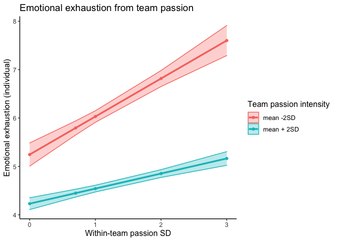
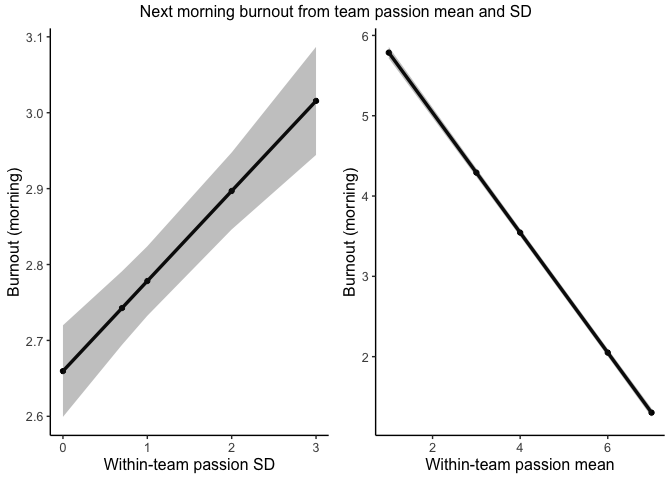

Passion interaction SD and mean
================

``` r
library(knitr)
library(dplyr)
library(tidyverse)
library(nlme)
library(lattice)
library(skimr)
library(ggplot2)
library(effects)
library(relativeVariability)
library(multilevel)
library(tidyr)
library(psych)
library(ggpubr)
```

## Prep

Create measurement indicator (m) and calculate within-team average
(mean.pas) and standard deviation (sd.pas) of passion (on each
measurement occasion). Calculate also average per day (mean.pas.d) and
sd per day (sd.pas.d). Create week-indicator (week)

``` r
load(file="d.Rdata")

d <- d[with(d, order(pid, day, type)),]

d <- d %>%
  group_by(pid) %>%
  mutate(m = 1:n()) %>%
  ungroup()

d$team <- as.factor(d$team)
d$pid <- as.factor(d$pid)

# There are 10 measurements with missings on passion, I delete these 
d <- d %>%
  filter(!is.na(s.pas))

d <- d %>%
  group_by(team, m) %>%
  mutate(sd.pas = sd(s.pas),
         mean.pas = mean(s.pas)) %>%
  ungroup()

# Passion SD and mean
d <- d %>%
  group_by(team, day) %>%
  mutate(sd.pas.d = sd(s.pas),
         mean.pas.d = mean(s.pas)) %>%
  ungroup()

# Week indicator
d <- d %>%
  mutate(week = case_when(
    day > 0 & day < 8 ~ 1,
    day > 7 & day < 15 ~2,
    day > 14 & day < 22 ~3))

# New day variable to indicate day of the week (1,2,3,4,5,6,7, 1,2,3,4,5,6,7 etc)
d <- d %>%
  mutate(day.new = case_when(
    day == 1 | day == 8 | day == 15 ~ 1,
    day == 2 | day == 9 | day == 16 ~ 2,
    day == 3 | day == 10 | day == 17 ~ 3,
    day == 4 | day == 11 | day == 18 ~ 4,
    day == 5 | day == 12 | day == 19 ~ 5,
    day == 6 | day == 13 | day == 20 ~ 6,
    day == 7 | day == 14 ~ 7))
```

## Predicting emotional exhaustion

Predicting emotional exhaustion (evening) from the interaction between
daily team passion mean and SD:

``` r
model_1 <- lme(fixed = s.ee ~ sd.pas.d + mean.pas.d,
                   random = ~1 | team/pid, 
                   data = d, 
                   na.action = na.omit)

summary(model_1)
```

    ## Linear mixed-effects model fit by REML
    ##   Data: d 
    ##        AIC      BIC    logLik
    ##   56610.17 56656.46 -28299.09
    ## 
    ## Random effects:
    ##  Formula: ~1 | team
    ##         (Intercept)
    ## StdDev:   0.1992932
    ## 
    ##  Formula: ~1 | pid %in% team
    ##         (Intercept) Residual
    ## StdDev:    1.218432 1.235588
    ## 
    ## Fixed effects:  s.ee ~ sd.pas.d + mean.pas.d 
    ##                 Value  Std.Error    DF   t-value p-value
    ## (Intercept)  5.455997 0.10689195 15748  51.04216  0.0000
    ## sd.pas.d    -0.033096 0.03336125 15748  -0.99204  0.3212
    ## mean.pas.d  -0.420181 0.01469299 15748 -28.59741  0.0000
    ##  Correlation: 
    ##            (Intr) sd.ps.
    ## sd.pas.d   -0.632       
    ## mean.pas.d -0.822  0.346
    ## 
    ## Standardized Within-Group Residuals:
    ##         Min          Q1         Med          Q3         Max 
    ## -5.67644092 -0.44069018 -0.04712748  0.37260524  4.85005559 
    ## 
    ## Number of Observations: 16579
    ## Number of Groups: 
    ##          team pid %in% team 
    ##           155           829

``` r
# Interaction
model_1b <- lme(fixed = s.ee ~ sd.pas.d + mean.pas.d + sd.pas.d*mean.pas.d,
                   random = ~1 | team/pid, 
                   data = d, 
                   na.action = na.omit)

summary(model_1b)
```

    ## Linear mixed-effects model fit by REML
    ##   Data: d 
    ##        AIC     BIC   logLik
    ##   56592.79 56646.8 -28289.4
    ## 
    ## Random effects:
    ##  Formula: ~1 | team
    ##         (Intercept)
    ## StdDev:   0.1883681
    ## 
    ##  Formula: ~1 | pid %in% team
    ##         (Intercept) Residual
    ## StdDev:    1.217963 1.234753
    ## 
    ## Fixed effects:  s.ee ~ sd.pas.d + mean.pas.d + sd.pas.d * mean.pas.d 
    ##                         Value  Std.Error    DF   t-value p-value
    ## (Intercept)          4.737114 0.17922601 15747 26.430953       0
    ## sd.pas.d             0.548611 0.12117944 15747  4.527262       0
    ## mean.pas.d          -0.270015 0.03347544 15747 -8.066063       0
    ## sd.pas.d:mean.pas.d -0.126147 0.02526774 15747 -4.992418       0
    ##  Correlation: 
    ##                     (Intr) sd.ps. mn.ps.
    ## sd.pas.d            -0.876              
    ## mean.pas.d          -0.937  0.906       
    ## sd.pas.d:mean.pas.d  0.804 -0.961 -0.899
    ## 
    ## Standardized Within-Group Residuals:
    ##         Min          Q1         Med          Q3         Max 
    ## -5.37145477 -0.44096776 -0.04844734  0.37186703  4.63794931 
    ## 
    ## Number of Observations: 16579
    ## Number of Groups: 
    ##          team pid %in% team 
    ##           155           829

``` r
# Likelihood check
model_1r <- lme(fixed = s.ee ~ sd.pas.d + mean.pas.d,
                   random = ~1 | team/pid, 
                   data = d, 
                   na.action = na.omit, method = "ML")

model_1br <- lme(fixed = s.ee ~ sd.pas.d + mean.pas.d + sd.pas.d*mean.pas.d,
                   random = ~1 | team/pid, 
                   data = d, 
                   na.action = na.omit, method = "ML")

anova(model_1r, model_1br)
```

    ##           Model df      AIC      BIC    logLik   Test L.Ratio p-value
    ## model_1r      1  6 56594.17 56640.46 -28291.08                       
    ## model_1br     2  7 56571.25 56625.26 -28278.63 1 vs 2 24.9135  <.0001

Plotting the interaction between passion SD and mean for higher and
lower levels of the mean (+ and -2 SD)

``` r
describe(d$mean.pas.d)
```

    ##    vars     n mean   sd median trimmed  mad  min max range  skew kurtosis se
    ## X1    1 49730 4.98 0.94   5.13    5.08 0.79 1.25   7  5.75 -1.02     1.23  0

``` r
#sd = 0.94 --> 2*0.94 = 1.88

eff <- effect("sd.pas.d:mean.pas.d", xlevels = list(mean.pas.d = c(-1.88, 1.88)), model_1b)

effdata <- as.data.frame(eff)

effdata$mean.pas.d <- as.factor(effdata$mean.pas.d)

plot <- ggplot(effdata, aes(x = sd.pas.d, y = fit, color = mean.pas.d, group = mean.pas.d)) +
  geom_point() +
  geom_line(size = 1.2) + 
  geom_ribbon(aes(ymin=fit-se, ymax=fit+se, fill=mean.pas.d),alpha=0.3) +
  labs(title = "Emotional exhaustion from team passion", x= "Within-team passion SD", y="Emotional exhaustion (individual)", color="Team passion intensity", fill="Team passion intensity") + theme_classic() + theme(text=element_text(size=12)) + 
  scale_fill_discrete(labels = c("mean -2SD", "mean + 2SD")) +   scale_color_discrete(labels = c("mean -2SD", "mean + 2SD"))
```

``` r
plot
```

<!-- -->
## Next morning stress and burnout

``` r
d <- d %>%
  mutate(stress.m = lead(s.em1, n=1L),
         burnout.m = lead(s.b2, 1L))

# Select only evening measurements (doesn't matter for average team passion/sd but does for stress)

d2 <- d %>%
  filter(type == "e")
```

Models for stress:

``` r
model_2 <- lme(fixed = stress.m ~ sd.pas.d + mean.pas.d,
                   random = ~1 | team/pid, 
                   data = d2, 
                   na.action = na.omit)

summary(model_2)
```

    ## Linear mixed-effects model fit by REML
    ##   Data: d2 
    ##        AIC      BIC    logLik
    ##   54235.75 54282.05 -27111.88
    ## 
    ## Random effects:
    ##  Formula: ~1 | team
    ##         (Intercept)
    ## StdDev:   0.3754818
    ## 
    ##  Formula: ~1 | pid %in% team
    ##         (Intercept) Residual
    ## StdDev:   0.9269408 1.158934
    ## 
    ## Fixed effects:  stress.m ~ sd.pas.d + mean.pas.d 
    ##                 Value  Std.Error    DF   t-value p-value
    ## (Intercept)  6.076507 0.10107451 15749  60.11908  0.0000
    ## sd.pas.d     0.116246 0.03135899 15749   3.70695  0.0002
    ## mean.pas.d  -0.689737 0.01379365 15749 -50.00390  0.0000
    ##  Correlation: 
    ##            (Intr) sd.ps.
    ## sd.pas.d   -0.627       
    ## mean.pas.d -0.815  0.345
    ## 
    ## Standardized Within-Group Residuals:
    ##         Min          Q1         Med          Q3         Max 
    ## -6.80519195 -0.48002085 -0.04697026  0.34614456  4.68695410 
    ## 
    ## Number of Observations: 16580
    ## Number of Groups: 
    ##          team pid %in% team 
    ##           155           829

``` r
# Interaction
model_2b <- lme(fixed = stress.m ~ sd.pas.d + mean.pas.d + sd.pas.d*mean.pas.d,
                   random = ~1 | team/pid, 
                   data = d2, 
                   na.action = na.omit)

summary(model_2b)
```

    ## Linear mixed-effects model fit by REML
    ##   Data: d2 
    ##     AIC      BIC logLik
    ##   54240 54294.01 -27113
    ## 
    ## Random effects:
    ##  Formula: ~1 | team
    ##         (Intercept)
    ## StdDev:   0.3734523
    ## 
    ##  Formula: ~1 | pid %in% team
    ##         (Intercept) Residual
    ## StdDev:   0.9269506 1.158872
    ## 
    ## Fixed effects:  stress.m ~ sd.pas.d + mean.pas.d + sd.pas.d * mean.pas.d 
    ##                         Value  Std.Error    DF   t-value p-value
    ## (Intercept)          5.827051 0.16883513 15748  34.51326  0.0000
    ## sd.pas.d             0.318066 0.11386714 15748   2.79331  0.0052
    ## mean.pas.d          -0.637596 0.03144526 15748 -20.27639  0.0000
    ## sd.pas.d:mean.pas.d -0.043800 0.02374473 15748  -1.84461  0.0651
    ##  Correlation: 
    ##                     (Intr) sd.ps. mn.ps.
    ## sd.pas.d            -0.874              
    ## mean.pas.d          -0.934  0.906       
    ## sd.pas.d:mean.pas.d  0.801 -0.961 -0.899
    ## 
    ## Standardized Within-Group Residuals:
    ##         Min          Q1         Med          Q3         Max 
    ## -6.69111065 -0.47960716 -0.04990245  0.34928551  4.69732547 
    ## 
    ## Number of Observations: 16580
    ## Number of Groups: 
    ##          team pid %in% team 
    ##           155           829

``` r
# Likelihood check
model_2r <- lme(fixed = stress.m ~ sd.pas.d + mean.pas.d,
                   random = ~1 | team/pid, 
                   data = d2, 
                   na.action = na.omit, method = "ML")

model_2br <- lme(fixed = stress.m ~ sd.pas.d + mean.pas.d + sd.pas.d*mean.pas.d,
                   random = ~1 | team/pid, 
                   data = d2, 
                   na.action = na.omit, method = "ML")

anova(model_2r, model_2br)
```

    ##           Model df      AIC      BIC    logLik   Test  L.Ratio p-value
    ## model_2r      1  6 54219.45 54265.75 -27103.73                        
    ## model_2br     2  7 54218.04 54272.06 -27102.02 1 vs 2 3.406845  0.0649

> Best model is model without interaction effect

Plots for stress:

``` r
eff1 <- effect(c("sd.pas.d"),  model_2)
eff2 <- effect(c("mean.pas.d"),  model_2)

effdata1 <- as.data.frame(eff1)
effdata2 <- as.data.frame(eff2)

plot1 <- ggplot(effdata1, aes(x = sd.pas.d, y = fit)) +
  geom_point() +
  geom_line(size = 1.2) + 
  geom_ribbon(aes(ymin=fit-se, ymax=fit+se),alpha=0.3) +
  labs(x= "Within-team passion SD", y="Stress (morning)") + theme_classic() + theme(text=element_text(size=12)) 

plot2 <- ggplot(effdata2, aes(x = mean.pas.d, y = fit)) +
  geom_point() +
  geom_line(size = 1.2) + 
  geom_ribbon(aes(ymin=fit-se, ymax=fit+se),alpha=0.3) +
  labs(x= "Within-team passion mean", y="Stress (morning)") + theme_classic() + theme(text=element_text(size=12)) 

library(ggpubr)

plots <- ggarrange(plot1, plot2, ncol = 2, nrow = 1)
plots <- annotate_figure(plots, top = text_grob("Next morning stress from team passion mean and SD"))

plots
```

<!-- -->
Models for burnout

``` r
model_3 <- lme(fixed = burnout.m ~ sd.pas.d + mean.pas.d,
                   random = ~1 | team/pid, 
                   data = d2, 
                   na.action = na.omit)

summary(model_3)
```

    ## Linear mixed-effects model fit by REML
    ##   Data: d2 
    ##        AIC      BIC    logLik
    ##   54826.23 54872.52 -27407.11
    ## 
    ## Random effects:
    ##  Formula: ~1 | team
    ##         (Intercept)
    ## StdDev:   0.3097383
    ## 
    ##  Formula: ~1 | pid %in% team
    ##         (Intercept) Residual
    ## StdDev:    1.042464 1.175795
    ## 
    ## Fixed effects:  burnout.m ~ sd.pas.d + mean.pas.d 
    ##                 Value  Std.Error    DF   t-value p-value
    ## (Intercept)  6.382957 0.10216404 15745  62.47753  0.0000
    ## sd.pas.d     0.118665 0.03178358 15745   3.73352  0.0002
    ## mean.pas.d  -0.747157 0.01399110 15745 -53.40227  0.0000
    ##  Correlation: 
    ##            (Intr) sd.ps.
    ## sd.pas.d   -0.629       
    ## mean.pas.d -0.818  0.345
    ## 
    ## Standardized Within-Group Residuals:
    ##         Min          Q1         Med          Q3         Max 
    ## -6.93703949 -0.46957697 -0.05974242  0.34385234  5.81815106 
    ## 
    ## Number of Observations: 16576
    ## Number of Groups: 
    ##          team pid %in% team 
    ##           155           829

``` r
# Interaction
model_3b <- lme(fixed = burnout.m ~ sd.pas.d + mean.pas.d + sd.pas.d*mean.pas.d,
                   random = ~1 | team/pid, 
                   data = d2, 
                   na.action = na.omit)

summary(model_3b)
```

    ## Linear mixed-effects model fit by REML
    ##   Data: d2 
    ##        AIC      BIC    logLik
    ##   54833.54 54887.55 -27409.77
    ## 
    ## Random effects:
    ##  Formula: ~1 | team
    ##         (Intercept)
    ## StdDev:   0.3103674
    ## 
    ##  Formula: ~1 | pid %in% team
    ##         (Intercept) Residual
    ## StdDev:    1.042481 1.175812
    ## 
    ## Fixed effects:  burnout.m ~ sd.pas.d + mean.pas.d + sd.pas.d * mean.pas.d 
    ##                         Value  Std.Error    DF   t-value p-value
    ## (Intercept)          6.458557 0.17107580 15744  37.75261  0.0000
    ## sd.pas.d             0.057526 0.11549163 15744   0.49810  0.6184
    ## mean.pas.d          -0.762953 0.03189579 15744 -23.92018  0.0000
    ## sd.pas.d:mean.pas.d  0.013265 0.02408346 15744   0.55079  0.5818
    ##  Correlation: 
    ##                     (Intr) sd.ps. mn.ps.
    ## sd.pas.d            -0.874              
    ## mean.pas.d          -0.935  0.906       
    ## sd.pas.d:mean.pas.d  0.802 -0.961 -0.899
    ## 
    ## Standardized Within-Group Residuals:
    ##        Min         Q1        Med         Q3        Max 
    ## -6.9710769 -0.4706300 -0.0598222  0.3448772  5.8419073 
    ## 
    ## Number of Observations: 16576
    ## Number of Groups: 
    ##          team pid %in% team 
    ##           155           829

``` r
# Likelihood check
model_3r <- lme(fixed = burnout.m ~ sd.pas.d + mean.pas.d,
                   random = ~1 | team/pid, 
                   data = d2, 
                   na.action = na.omit, method = "ML")

model_3br <- lme(fixed = burnout.m ~ sd.pas.d + mean.pas.d + sd.pas.d*mean.pas.d,
                   random = ~1 | team/pid, 
                   data = d2, 
                   na.action = na.omit, method = "ML")

anova(model_3r, model_3br)
```

    ##           Model df      AIC      BIC    logLik   Test   L.Ratio p-value
    ## model_3r      1  6 54809.97 54856.27 -27398.99                         
    ## model_3br     2  7 54811.67 54865.68 -27398.83 1 vs 2 0.3019583  0.5827

> The model without the interaction is best but there are main effects
> for the meand and SD

Plots for burnout:

``` r
eff1 <- effect(c("sd.pas.d"),  model_3)
eff2 <- effect(c("mean.pas.d"),  model_3)

effdata1 <- as.data.frame(eff1)
effdata2 <- as.data.frame(eff2)

plot1 <- ggplot(effdata1, aes(x = sd.pas.d, y = fit)) +
  geom_point() +
  geom_line(size = 1.2) + 
  geom_ribbon(aes(ymin=fit-se, ymax=fit+se),alpha=0.3) +
  labs(x= "Within-team passion SD", y="Burnout (morning)") + theme_classic() + theme(text=element_text(size=12)) 

plot2 <- ggplot(effdata2, aes(x = mean.pas.d, y = fit)) +
  geom_point() +
  geom_line(size = 1.2) + 
  geom_ribbon(aes(ymin=fit-se, ymax=fit+se),alpha=0.3) +
  labs(x= "Within-team passion mean", y="Burnout (morning)") + theme_classic() + theme(text=element_text(size=12)) 

plots <- ggarrange(plot1, plot2, ncol = 2, nrow = 1)
plots <- annotate_figure(plots, top = text_grob("Next morning burnout from team passion mean and SD"))

plots
```

<!-- -->
