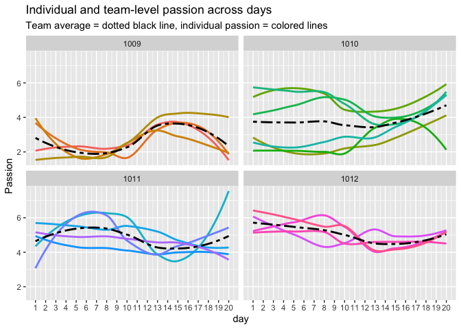
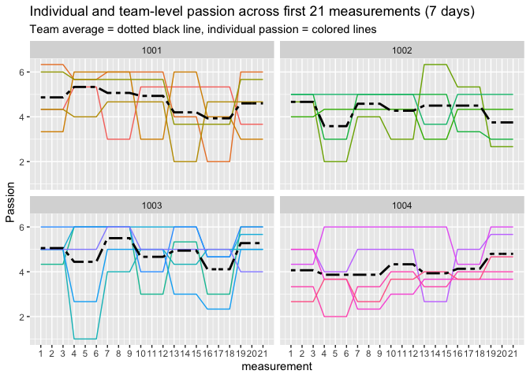
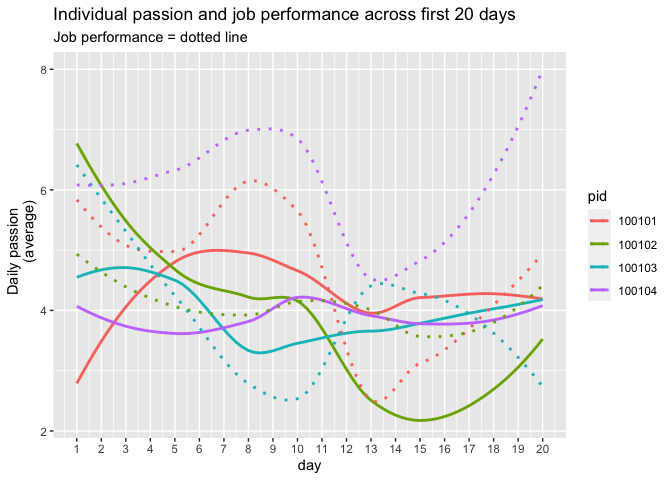

Passion plots
================

``` r
library(dplyr)
library(tidyverse)
library(psych)
library(ggplot2)
```

``` r
load("d.Rdata")
```

### Individual and team-level passion across days

``` r
d <- d[with(d, order(pid, day, type)),]

d$pid <- as.factor(d$pid)
d$team <- as.factor(d$team)

#Average passion per day 
d <- d %>%
  group_by(pid, day) %>%
  mutate(pas_pm = mean(s.pas, na.rm=TRUE))

d <- d %>%
  group_by(team, day) %>%
  mutate(pas_tm = mean(s.pas, na.rm=TRUE))

# First 20 days, 4 teams
d %>%
  filter(day < 21 & type == "e") %>%
  filter(team == 1001 | team == 1002 | team == 1003 | team == 1004) %>%
  ggplot(aes(x = day, y=pas_pm, color= pid)) +
  geom_line(aes(y=pas_pm)) +
  geom_line(aes(y = pas_tm), linetype = "twodash", size=1, color = "black") +
  labs(title = "Individual and team-level passion across days", y = "Passion",
       subtitle = "Team average = dotted black line, individual passion = colored lines") +
  scale_x_continuous(breaks = 1:20) +
  theme(legend.position="none") + 
  facet_wrap(~ team)
```

<!-- -->

``` r
# Pretty difficult to see. Maybe some smoothing. 
d %>%
  filter(day < 21 & type == "e") %>%
  filter(team == 1001 | team == 1002 | team == 1003 | team == 1004) %>%
   ggplot(aes(x = day, y=pas_pm, color= pid)) +
  geom_smooth(aes(y=pas_pm), method = "loess", se=FALSE) +
  geom_smooth(aes(y = pas_tm), method = "loess", se=FALSE, linetype = "twodash", color="black") + 
  labs(title = "Individual and team-level passion across days", y = "Passion",
        subtitle = "Team average = dotted black line, individual passion = colored lines") +
  scale_x_continuous(breaks = 1:20) +
   theme(legend.position="none") + 
   facet_wrap(~ team)
```

<!-- -->

``` r
# 4 other teams 
d %>%
  filter(day < 21 & type == "e") %>%
  filter(team == 1005 | team == 1006 | team == 1007 | team == 1008) %>%
   ggplot(aes(x = day, y=pas_pm, color= pid)) +
  geom_smooth(aes(y=pas_pm), method = "loess", se=FALSE) +
  geom_smooth(aes(y = pas_tm), method = "loess", se=FALSE, linetype = "twodash", color="black") + 
 labs(title = "Individual and team-level passion across days", y = "Passion",
        subtitle = "Team average = dotted black line, individual passion = colored lines") +
  scale_x_continuous(breaks = 1:20) +
   theme(legend.position="none") + 
   facet_wrap(~ team)
```

<!-- -->

``` r
# 4 other teams
d %>%
  filter(day < 21 & type == "e") %>%
  filter(team == 1009 | team == 1010 | team == 1011 | team == 1012) %>%
   ggplot(aes(x = day, y=pas_pm, color= pid)) +
  geom_smooth(aes(y=pas_pm), method = "loess", se=FALSE) +
  geom_smooth(aes(y = pas_tm), method = "loess", se=FALSE, linetype = "twodash", color="black") + 
  labs(title = "Individual and team-level passion across days", y = "Passion",
       subtitle = "Team average = dotted black line, individual passion = colored lines") +
  scale_x_continuous(breaks = 1:20) +
   theme(legend.position="none") + 
   facet_wrap(~ team)
```

<!-- -->

### Individual and team-level passion across measurements

``` r
d <- d %>%
  group_by(pid) %>%
  dplyr::mutate(measurement = 1:n())

# First 21 measurements, 4 teams
d %>%
  filter(measurement < 22) %>%
  filter(team == 1001 | team == 1002 | team == 1003 | team == 1004) %>%
  ggplot(aes(x = measurement, y=pas_pm, color= pid)) +
  geom_line(aes(y=pas_pm)) +
  geom_line(aes(y = pas_tm), linetype = "twodash", size=1, color="black") +
  labs(title = "Individual and team-level passion across first 21 measurements (7 days)", y = "Passion",
       subtitle = "Team average = dotted black line, individual passion = colored lines") +
  scale_x_continuous(breaks = 1:21) +
   theme(legend.position="none") + 
  facet_wrap(~ team)
```

<!-- -->

``` r
# Pretty difficult to see. Maybe some smoothing. 
d %>%
 filter(measurement < 22) %>%
  filter(team == 1001 | team == 1002 | team == 1003 | team == 1004) %>%
   ggplot(aes(x = measurement, y=pas_pm, color= pid)) +
  geom_smooth(aes(y=pas_pm), method = "loess", se=FALSE) +
  geom_smooth(aes(y = pas_tm), method = "loess", se=FALSE, linetype = "twodash", color="black") + 
 labs(title = "Individual and team-level passion across first 21 measurements (7 days)", y = "Passion",
       subtitle = "Team average = dotted black line, individual passion = colored lines") +
  scale_x_continuous(breaks = 1:21) +
   theme(legend.position="none") + 
  facet_wrap(~ team)
```

<!-- -->

``` r
# 4 other teams 
d %>%
 filter(measurement < 22) %>%
  filter(team == 1005 | team == 1006 | team == 1007 | team == 1008) %>%
   ggplot(aes(x = measurement, y=pas_pm, color= pid)) +
  geom_smooth(aes(y=pas_pm), method = "loess", se=FALSE) +
  geom_smooth(aes(y = pas_tm), method = "loess", se=FALSE, linetype = "twodash", color="black") + 
  labs(title = "Individual and team-level passion across first 21 measurements (7 days)", y = "Passion",
       subtitle = "Team average = dotted black line, individual passion = colored lines") +
  scale_x_continuous(breaks = 1:21) +
   theme(legend.position="none") + 
  facet_wrap(~ team)
```

<!-- -->

``` r
# 4 other teams
d %>%
 filter(measurement < 22) %>%
  filter(team == 1009 | team == 1010 | team == 1011 | team == 1012) %>%
   ggplot(aes(x = measurement, y=pas_pm, color= pid)) +
  geom_smooth(aes(y=pas_pm), method = "loess", se=FALSE) +
  geom_smooth(aes(y = pas_tm), method = "loess", se=FALSE, linetype = "twodash", color="black") + 
  labs(title = "Individual and team-level passion across first 21 measurements (7 days)", y = "Passion",
       subtitle = "Team average = dotted black line, individual passion = colored lines") +
  scale_x_continuous(breaks = 1:21) +
   theme(legend.position="none") + 
  facet_wrap(~ team)
```

<!-- -->

### Passion and job performance across days

``` r
# First 20 days, 4 participants
d %>%
  filter(day < 21 & type == "e") %>%
  filter(pid == 100101 | pid == 100102 | pid == 100103 | pid == 100104 ) %>%
  ggplot(aes(x = day, y=pas_pm, color= pid)) +
  geom_line(aes(y=pas_pm)) +
  geom_line(aes(y = s.jp), linetype = "dotted") + 
  labs(title = "Individual passion and job performance across first 20 days", y = "Daily passion   
       (average)", subtitle = "Job performance = dotted line") +
  scale_x_continuous(breaks = 1:20) 
```

<!-- -->

``` r
# With smooth lines: 
d %>%
  filter(day < 21 & type == "e") %>%
  filter(pid == 100101 | pid == 100102 | pid == 100103 | pid == 100104 ) %>%
  ggplot(aes(x = day, y = s.pas, color= pid)) +
  geom_smooth(method = "loess", se=FALSE) +
  geom_smooth(aes(y = s.jp), method = "loess", se=FALSE, linetype = "dotted") + 
  labs(title = "Individual passion and job performance across first 20 days", y = "Daily passion   
       (average)", subtitle = "Job performance = dotted line") +
  scale_x_continuous(breaks = 1:20) 
```

<!-- -->

``` r
# 4 other participants
d %>%
  filter(day < 21 & type == "e") %>%
  filter(pid == 100201 | pid == 100202 | pid == 100203 | pid == 100204) %>%
  ggplot(aes(x = day, y = s.pas, color= pid)) +
  geom_smooth(method = "loess", se=FALSE) +
  geom_smooth(aes(y = s.jp), method = "loess", se=FALSE, linetype = "dotted") + 
  labs(title = "Individual passion and job performance across first 20 days", y = "Daily passion   
       (average)", subtitle = "Job performance = dotted line") +
  scale_x_continuous(breaks = 1:20) 
```

<!-- -->

``` r
# 4 more
d %>%
  filter(day < 21 & type == "e") %>%
  filter(pid == 100503 | pid == 100504 | pid == 100505 | pid == 100506 ) %>%
  ggplot(aes(x = day, y = s.pas, color= pid)) +
  geom_smooth(method = "loess", se=FALSE) +
  geom_smooth(aes(y = s.jp), method = "loess", se=FALSE, linetype = "dotted") + 
  labs(title = "Individual passion and job performance across first 20 days", y = "Daily passion   
       (average)", subtitle = "Job performance = dotted line") +
  scale_x_continuous(breaks = 1:20) 
```

<!-- -->

### Passion and burnout across measurements

``` r
# First 21 measurements (= 7 days), 4 participants
d %>%
  filter(measurement < 22) %>%
  filter(pid == 100101 | pid == 100102 | pid == 100103 | pid == 100104 ) %>%
  ggplot(aes(x = measurement, y=s.pas, color= pid)) +
  geom_line(aes(y=s.pas)) +
  geom_line(aes(y = s.b2), linetype = "dotted") + 
  labs(title = "Individual passion and burnout across first 21 measurements (7 days)",
       subtitle = "Burnout = dotted line") +
  scale_x_continuous(breaks = 1:21) 
```

    ## Warning: Removed 1 row(s) containing missing values (geom_path).

<!-- -->

``` r
# With smooth lines: 
d %>%
  filter(measurement < 22) %>%
  filter(pid == 100101 | pid == 100102 | pid == 100103 | pid == 100104 ) %>%
  ggplot(aes(x = measurement, y = s.pas, color= pid)) +
  geom_smooth(method = "loess", se=FALSE) +
  geom_smooth(aes(y = s.b2), method = "loess", se=FALSE, linetype = "dotted") + 
  labs(title = "Individual passion and burnout across first 21 measurements (7 days)",
       subtitle = "Burnout = dotted line") +
  scale_x_continuous(breaks = 1:21) 
```

    ## Warning: Removed 1 rows containing non-finite values (stat_smooth).

<!-- -->

``` r
# 4 other participants
d %>%
  filter(measurement < 22) %>%
  filter(pid == 100201 | pid == 100202 | pid == 100203 | pid == 100204) %>%
  ggplot(aes(x = measurement, y = s.pas, color= pid)) +
  geom_smooth(method = "loess", se=FALSE) +
  geom_smooth(aes(y = s.b2), method = "loess", se=FALSE, linetype = "dotted") + 
  labs(title = "Individual passion and burnout across first 21 measurements (7 days)",
       subtitle = "Burnout = dotted line") +
  scale_x_continuous(breaks = 1:21) 
```

    ## Warning: Removed 1 rows containing non-finite values (stat_smooth).

<!-- -->

``` r
# 4 more
d %>%
  filter(measurement < 22) %>%
  filter(pid == 100503 | pid == 100504 | pid == 100505 | pid == 100506 ) %>%
  ggplot(aes(x = measurement, y = s.pas, color= pid)) +
  geom_smooth(method = "loess", se=FALSE) +
  geom_smooth(aes(y = s.b2), method = "loess", se=FALSE, linetype = "dotted") + 
  labs(title = "Individual passion and burnout across first 21 measurements (7 days)",
       subtitle = "Burnout = dotted line") +
  scale_x_continuous(breaks = 1:21) 
```

<!-- -->
