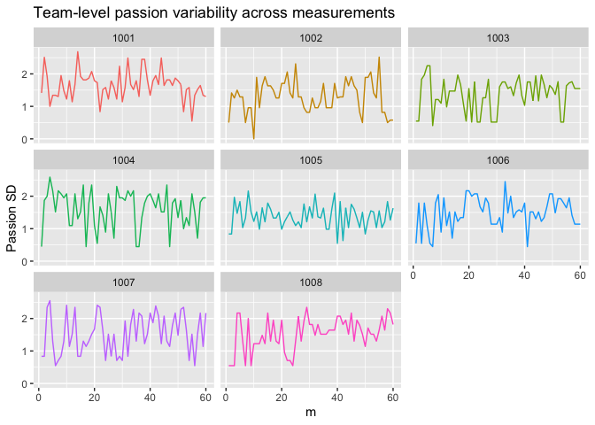

Predicting passion variance over time
================

``` r
library(knitr)
library(dplyr)
library(tidyverse)
library(nlme)
library(lattice)
library(skimr)
library(ggplot2)
library(effects)
library(relativeVariability)
library(multilevel)
```

## Prep

Create measurement indicator (m) and calculate within-team average
(mean.pas) and standard deviation (sd.pas) of passion:

``` r
load(file="d.Rdata")

d <- d[with(d, order(pid, day, type)),]

d <- d %>%
  group_by(pid) %>%
  mutate(m = 1:n()) %>%
  ungroup()

d$team <- as.factor(d$team)
d$pid <- as.factor(d$pid)

# There are 10 measurements with missings on passion, I delete these 
d <- d %>%
  filter(!is.na(s.pas))

d <- d %>%
  group_by(team, m) %>%
  mutate(sd.pas = sd(s.pas),
         mean.pas = mean(s.pas)) %>%
  ungroup()
```

## Plot

Some plots of within-team variability over time

``` r
d %>%
  filter(team == 1001 | team == 1002 | team == 1003 | team == 1004 |
         team == 1005 | team == 1006 | team == 1007 | team == 1008) %>%
  ggplot(aes(x = m, y=sd.pas, color= team)) +
  geom_line(aes(y=sd.pas)) +
  labs(title = "Team-level passion variability across measurements", y = "Passion SD") +
   theme(legend.position="none") + 
  facet_wrap(~team)
```

<!-- -->

> There does not seem to be much of a pattern in passion variability
> over time

## Using the standard deviation

Predicting within-team passion variance over time with “m” as predictor.

``` r
# Random intercept
model_1 <- lme(fixed = sd.pas ~ m,
                   random = ~1 | team, 
                   data = d, 
                   na.action = na.omit)

summary(model_1)
```

    ## Linear mixed-effects model fit by REML
    ##   Data: d 
    ##        AIC      BIC    logLik
    ##   64995.03 65030.28 -32493.51
    ## 
    ## Random effects:
    ##  Formula: ~1 | team
    ##         (Intercept)  Residual
    ## StdDev:   0.4242792 0.4609574
    ## 
    ## Fixed effects:  sd.pas ~ m 
    ##                 Value  Std.Error    DF  t-value p-value
    ## (Intercept) 1.2261057 0.03433702 49574 35.70798       0
    ## m           0.0005098 0.00011936 49574  4.27153       0
    ##  Correlation: 
    ##   (Intr)
    ## m -0.106
    ## 
    ## Standardized Within-Group Residuals:
    ##         Min          Q1         Med          Q3         Max 
    ## -4.16370651 -0.54721390 -0.09664659  0.49078738  5.05425027 
    ## 
    ## Number of Observations: 49730
    ## Number of Groups: 155

``` r
# Random slope
model_1b <- lme(fixed = sd.pas ~ m,
                   random = ~m | team, 
                   data = d, 
                   na.action = na.omit)

summary(model_1b)
```

    ## Linear mixed-effects model fit by REML
    ##   Data: d 
    ##        AIC      BIC    logLik
    ##   64041.44 64094.32 -32014.72
    ## 
    ## Random effects:
    ##  Formula: ~m | team
    ##  Structure: General positive-definite, Log-Cholesky parametrization
    ##             StdDev      Corr  
    ## (Intercept) 0.414048280 (Intr)
    ## m           0.004355853 -0.082
    ## Residual    0.454953588       
    ## 
    ## Fixed effects:  sd.pas ~ m 
    ##                 Value  Std.Error    DF  t-value p-value
    ## (Intercept) 1.2248130 0.03352006 49574 36.53970  0.0000
    ## m           0.0005524 0.00036969 49574  1.49423  0.1351
    ##  Correlation: 
    ##   (Intr)
    ## m -0.112
    ## 
    ## Standardized Within-Group Residuals:
    ##        Min         Q1        Med         Q3        Max 
    ## -4.1224039 -0.5455183 -0.0973136  0.4799245  5.0794006 
    ## 
    ## Number of Observations: 49730
    ## Number of Groups: 155

``` r
# Compare likelihoods (using ML instead of REML, otherwise likelihoods are not comparable)
model_1_r <- lme(fixed = sd.pas ~ m,
                   random = ~1 | team, 
                   data = d, 
                   na.action = na.omit, method = "ML")

model_1b_r <- lme(fixed = sd.pas ~ m,
                   random = ~m | team, 
                   data = d, 
                   na.action = na.omit, method = "ML")

anova(model_1_r, model_1b_r)
```

    ##            Model df      AIC      BIC    logLik   Test  L.Ratio p-value
    ## model_1_r      1  4 64973.88 65009.14 -32482.94                        
    ## model_1b_r     2  6 64022.50 64075.38 -32005.25 1 vs 2 955.3809  <.0001

``` r
# Include the mean of passion (because of sd - mean confounding)
model_1c <- lme(fixed = sd.pas ~ m + mean.pas,
                   random = ~m | team, 
                   data = d, 
                   na.action = na.omit)

summary(model_1c)
```

    ## Linear mixed-effects model fit by REML
    ##   Data: d 
    ##        AIC      BIC    logLik
    ##   56295.16 56356.86 -28140.58
    ## 
    ## Random effects:
    ##  Formula: ~m | team
    ##  Structure: General positive-definite, Log-Cholesky parametrization
    ##             StdDev      Corr  
    ## (Intercept) 0.347376015 (Intr)
    ## m           0.004429475 -0.156
    ## Residual    0.420843598       
    ## 
    ## Fixed effects:  sd.pas ~ m + mean.pas 
    ##                  Value   Std.Error    DF   t-value p-value
    ## (Intercept)  2.3569013 0.030758068 49573  76.62709  0.0000
    ## m           -0.0002257 0.000372644 49573  -0.60571  0.5447
    ## mean.pas    -0.2224940 0.002427100 49573 -91.67071  0.0000
    ##  Correlation: 
    ##          (Intr) m     
    ## m        -0.176       
    ## mean.pas -0.402  0.023
    ## 
    ## Standardized Within-Group Residuals:
    ##         Min          Q1         Med          Q3         Max 
    ## -4.79754038 -0.54746163 -0.05893481  0.48506171  4.98299732 
    ## 
    ## Number of Observations: 49730
    ## Number of Groups: 155

``` r
# Compare likelihoods
model_1c_r <- lme(fixed = sd.pas ~ m + mean.pas,
                   random = ~m | team, 
                   data = d, 
                   na.action = na.omit, method = "ML", control = lmeControl(opt = "optim"))

anova(model_1b_r, model_1c_r)
```

    ##            Model df      AIC      BIC    logLik   Test  L.Ratio p-value
    ## model_1b_r     1  6 64022.50 64075.38 -32005.25                        
    ## model_1c_r     2  7 56265.66 56327.36 -28125.83 1 vs 2 7758.834  <.0001

> The third model (including mean passion score and random slope for m)
> has a better fit. In this model, there’s no significant association
> between time and within-team passion variability.

## Using the relative standard deviation

Relative variability index \>\>\> this is a measure of variability that
is not confounded by the mean. See also Mestdagh et al. (2018,
<http://dx.doi.org/10.1037/met0000153>).

``` r
# Calculate relative variability rl.sd
rel.sd <- function(x) {
  relativeSD(x, MIN = 1, MAX=7)
}

d2 <- d %>%
  group_by(team, m) %>%
  mutate(rl.sd = rel.sd(s.pas))
```

    ## Warning in checkOutput(M, MIN, MAX): NaN returned. Data has a mean equal the
    ## maximum

    ## Warning in checkOutput(M, MIN, MAX): NaN returned. Data has a mean equal the
    ## maximum

    ## Warning in checkOutput(M, MIN, MAX): NaN returned. Data has a mean equal the
    ## maximum

    ## Warning in checkOutput(M, MIN, MAX): NaN returned. Data has a mean equal the
    ## maximum

    ## Warning in checkOutput(M, MIN, MAX): NaN returned. Data has a mean equal the
    ## maximum

    ## Warning in checkOutput(M, MIN, MAX): NaN returned. Data has a mean equal the
    ## minimum

    ## Warning in checkOutput(M, MIN, MAX): NaN returned. Data has a mean equal the
    ## maximum

    ## Warning in checkOutput(M, MIN, MAX): NaN returned. Data has a mean equal the
    ## maximum

    ## Warning in checkOutput(M, MIN, MAX): NaN returned. Data has a mean equal the
    ## maximum

``` r
# calculate relation bewteen mean and variability measures
rlin1=cor(d2$mean.pas, d2$sd.pas)
rlin2=cor(d2$mean.pas, d2$rl.sd, use = "complete.obs")
print(rlin1)
```

    ## [1] -0.48198

``` r
print(rlin2)
```

    ## [1] -0.2530156

Predicting within-team passion variance over time using the relative sd.

``` r
# Random intercept
model_2 <- lme(fixed = rl.sd ~ m,
                   random = ~1 | team, 
                   data = d2, 
                   na.action = na.omit)

summary(model_2)
```

    ## Linear mixed-effects model fit by REML
    ##   Data: d2 
    ##         AIC       BIC   logLik
    ##   -38617.67 -38582.41 19312.83
    ## 
    ## Random effects:
    ##  Formula: ~1 | team
    ##         (Intercept)  Residual
    ## StdDev:   0.1395277 0.1626125
    ## 
    ## Fixed effects:  rl.sd ~ m 
    ##                  Value   Std.Error    DF  t-value p-value
    ## (Intercept)  0.4820388 0.011304855 49529 42.63998       0
    ## m           -0.0002003 0.000042135 49529 -4.75383       0
    ##  Correlation: 
    ##   (Intr)
    ## m -0.114
    ## 
    ## Standardized Within-Group Residuals:
    ##         Min          Q1         Med          Q3         Max 
    ## -3.84525054 -0.57666331 -0.08029063  0.49035383  4.72536270 
    ## 
    ## Number of Observations: 49685
    ## Number of Groups: 155

``` r
# Random slope
model_2b <- lme(fixed = rl.sd ~ m,
                   random = ~m | team, 
                   data = d2, 
                   na.action = na.omit)

summary(model_2b)
```

    ## Linear mixed-effects model fit by REML
    ##   Data: d2 
    ##         AIC       BIC   logLik
    ##   -39526.13 -39473.25 19769.07
    ## 
    ## Random effects:
    ##  Formula: ~m | team
    ##  Structure: General positive-definite, Log-Cholesky parametrization
    ##             StdDev      Corr  
    ## (Intercept) 0.135103740 (Intr)
    ## m           0.001480225 -0.067
    ## Residual    0.160585752       
    ## 
    ## Fixed effects:  rl.sd ~ m 
    ##                  Value   Std.Error    DF  t-value p-value
    ## (Intercept)  0.4825992 0.010952230 49529 44.06402  0.0000
    ## m           -0.0002183 0.000126156 49529 -1.73058  0.0835
    ##  Correlation: 
    ##   (Intr)
    ## m -0.102
    ## 
    ## Standardized Within-Group Residuals:
    ##         Min          Q1         Med          Q3         Max 
    ## -3.87384384 -0.58348967 -0.06304755  0.48233405  4.78712635 
    ## 
    ## Number of Observations: 49685
    ## Number of Groups: 155

``` r
# Check likelihoods
model_2_r <- lme(fixed = rl.sd ~ m,
                   random = ~1 | team, 
                   data = d2, 
                   na.action = na.omit, method = "ML")

model_2b_r <- lme(fixed = rl.sd ~ m,
                   random = ~m | team, 
                   data = d2, 
                   na.action = na.omit, method = "ML")

anova(model_2_r, model_2b_r)
```

    ##            Model df       AIC       BIC   logLik   Test  L.Ratio p-value
    ## model_2_r      1  4 -38643.12 -38607.87 19325.56                        
    ## model_2b_r     2  6 -39549.46 -39496.58 19780.73 1 vs 2 910.3376  <.0001

> The second model (random slope) has a better fit. In this model there
> is no significant association between time and passion variability.

## Modeling residual variances

``` r
# Examine change in groups' latent means over time
step1 <- lme(s.pas ~ m, random =
             list(team = pdDiag(~1), pid = pdSymm(~1)),
             data = d, method = "ML", control = lmeControl(opt = "optim"))

# Examine variability in slopes
step2a <-update(step1, random = list(team = pdDiag(~m), pid=pdSymm(~1)))
summary(step2a)
```

    ## Linear mixed-effects model fit by maximum likelihood
    ##   Data: d 
    ##        AIC      BIC    logLik
    ##   171377.8 171430.7 -85682.92
    ## 
    ## Random effects:
    ##  Formula: ~m | team
    ##  Structure: Diagonal
    ##         (Intercept)          m
    ## StdDev:   0.5881536 0.00873138
    ## 
    ##  Formula: ~1 | pid %in% team
    ##         (Intercept) Residual
    ## StdDev:   0.7526064 1.315202
    ## 
    ## Fixed effects:  s.pas ~ m 
    ##                 Value  Std.Error    DF  t-value p-value
    ## (Intercept)  5.085680 0.05546178 48900 91.69703       0
    ## m           -0.003464 0.00078145 48900 -4.43232       0
    ##  Correlation: 
    ##   (Intr)
    ## m -0.083
    ## 
    ## Standardized Within-Group Residuals:
    ##        Min         Q1        Med         Q3        Max 
    ## -4.3489764 -0.3932137  0.1149281  0.5596119  3.7145864 
    ## 
    ## Number of Observations: 49730
    ## Number of Groups: 
    ##          team pid %in% team 
    ##           155           829

``` r
VarCorr(step2a)
```

    ##             Variance     StdDev    
    ## team =      pdDiag(m)              
    ## (Intercept) 3.459247e-01 0.58815360
    ## m           7.623699e-05 0.00873138
    ## pid =       pdSymm(1)              
    ## (Intercept) 5.664164e-01 0.75260640
    ## Residual    1.729756e+00 1.31520206

``` r
step2b <-update(step2a, random = list(team = pdSymm(~m), pid=pdSymm(~1)), 
                control = lmeControl(opt = "optim"))

summary(step2b)
```

    ## Linear mixed-effects model fit by maximum likelihood
    ##   Data: d 
    ##      AIC      BIC    logLik
    ##   171358 171419.7 -85671.99
    ## 
    ## Random effects:
    ##  Formula: ~m | team
    ##  Structure: General positive-definite
    ##             StdDev      Corr  
    ## (Intercept) 0.612101306 (Intr)
    ## m           0.009054277 -0.452
    ## 
    ##  Formula: ~1 | pid %in% team
    ##         (Intercept) Residual
    ## StdDev:   0.7526305 1.315075
    ## 
    ## Fixed effects:  s.pas ~ m 
    ##                 Value  Std.Error    DF  t-value p-value
    ## (Intercept)  5.087757 0.05711471 48900 89.07962       0
    ## m           -0.003472 0.00080487 48900 -4.31403       0
    ##  Correlation: 
    ##   (Intr)
    ## m -0.431
    ## 
    ## Standardized Within-Group Residuals:
    ##        Min         Q1        Med         Q3        Max 
    ## -4.3617115 -0.3930380  0.1141378  0.5599390  3.7160078 
    ## 
    ## Number of Observations: 49730
    ## Number of Groups: 
    ##          team pid %in% team 
    ##           155           829

``` r
VarCorr(step2b)
```

    ##             Variance     StdDev      Corr  
    ## team =      pdSymm(m)                      
    ## (Intercept) 3.746680e-01 0.612101306 (Intr)
    ## m           8.197993e-05 0.009054277 -0.452
    ## pid =       pdSymm(1)                      
    ## (Intercept) 5.664527e-01 0.752630550       
    ## Residual    1.729423e+00 1.315075316

``` r
anova(step1, step2a, step2b)
```

    ##        Model df      AIC      BIC    logLik   Test  L.Ratio p-value
    ## step1      1  5 171809.5 171853.6 -85899.76                        
    ## step2a     2  6 171377.9 171430.7 -85682.92 1 vs 2 433.6699  <.0001
    ## step2b     3  7 171358.0 171419.7 -85671.99 2 vs 3  21.8705  <.0001

``` r
# Examine whether there's a change in residual variance (i.e., consensus emergence) over time
step3 <- update(step2b, weights = varExp(form = ~ m))

anova(step1, step2a, step2b, step3)
```

    ##        Model df      AIC      BIC    logLik   Test  L.Ratio p-value
    ## step1      1  5 171809.5 171853.6 -85899.76                        
    ## step2a     2  6 171377.9 171430.7 -85682.92 1 vs 2 433.6699  <.0001
    ## step2b     3  7 171358.0 171419.7 -85671.99 2 vs 3  21.8705  <.0001
    ## step3      4  8 171312.0 171382.5 -85648.01 3 vs 4  47.9642  <.0001

``` r
summary(step3)$tTable
```

    ##                    Value   Std.Error    DF   t-value      p-value
    ## (Intercept)  5.090886838 0.057240971 48900 88.937813 0.000000e+00
    ## m           -0.003574708 0.000813199 48900 -4.395859 1.105676e-05

``` r
VarCorr(step3)
```

    ##             Variance     StdDev      Corr  
    ## team =      pdSymm(m)                      
    ## (Intercept) 3.777001e-01 0.614573126 (Intr)
    ## m           8.408251e-05 0.009169652 -0.46 
    ## pid =       pdSymm(1)                      
    ## (Intercept) 5.669782e-01 0.752979524       
    ## Residual    1.593954e+00 1.262518797

``` r
summary(step3)$modelStruct$varStruct
```

    ## Variance function structure of class varExp representing
    ##       expon 
    ## 0.001319563

> Suggests residual variance increases over time (but only minimally),
> and therefore that team members become less similar in their passion
> scores.
